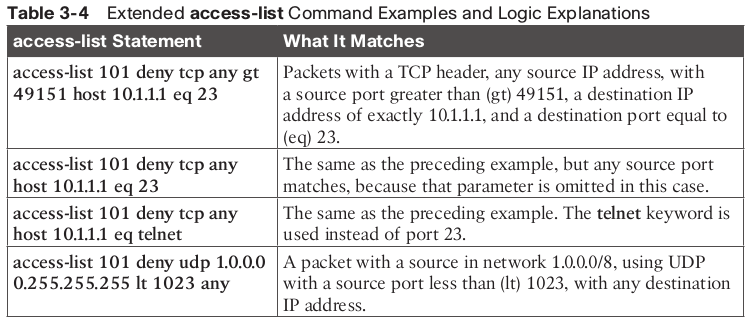

# ACL
Access Control List

netsh interface ipv4 show subinterfaces. 

Multiplexing is a ability of computer to combine and distingvish signals/data in the wire with the help of ports.
0-1023 - well-known ports, 1024-49151 - users ports

To accomplish reliability, TCP numbers data bytes using the Sequence and Acknowledgment fields in the TCP header.

windowing is an amount of data that receiver can handle at once. 

ACL is  - An Access Control List (ACL) is a set of rules that is usually used to filter network traffic. 
ACL is sitting in the forwarding path of the packets.

ACP logic can be applied at  extrance and exit of the interface.

Types of ACLs:
■ Standard numbered ACLs (1–99)
■ Extended numbered ACLs (100–199)
■ Additional ACL numbers (1300–1999 standard, 2000–2699 extended)
■ Named ACLs
■ Improved editing with sequence numbers

Each command has different matching logic that the router must apply to each packet when filtering using that ACL.
ACLs use first-match logic!!!!

**Finally, if a packet does not match any of the items in the ACL, the packet is discarded.**

`access-list {1-99 | 1300-1999} {permit | deny} matching-parameters`

to match exact ip:
`access-list 1 permit 10.1.1.1`
Old syntax
`access-list 1 permit host 10.1.1.1`

Matching subset of address:
`access-list 1 deny 10.1.1.0 0.0.0.255`

this could be used to explicitly replace implicit default "deny any" rule that is located at the end of the list
`access-list 1 permit any`

OR if you want to see implicit deny all explicitly, one can specify `deny any` as the last rule.

```
show access-lists
show ip interface gi0/0/1
```

Each line (rule) in an ACL as an Access Control Entry (ACE)

Extended ACLs differ from standard ACLs mostly because of the larger variety of packet header fields that can be used to match a packet.
Parameters: the IP protocol type, the source IP address, and the destination IP address.
protocol tcp, udp icmp OR use ip to match all protocol but specify ip

Extended access lists. Use a number between 100 199 or 2000-2699

```
access-list access-list-number {deny | permit} protocol 
source source-wildcard destination destination-wildcard [log | log-input] 
access-list access-list-number {deny | permit} tcp | udp} 
source source-wildcard [operator [port]]
destination destination-wildcard [operator [port]] [established] [log]
```

When matching a specific IP address, the extended ACL requires the use of the host keyword. You cannot simply list the IP address alone.


Checking **destination** port 

access-list 101 permit tcp 172.16.1.0 0.0.0.255 172.16.3.0 0.0.0.255 **eq 21**

Checking **source** port 

access-list 101 permit tcp 172.16.1.0 0.0.0.255 **eq 21** 172.16.3.0 0.0.0.255 




Named ACLs originally had three big differences compared to numbered ACLs:
■ Using names instead of numbers to identify the ACL, making it easier to remember the reason for the ACL
■ Using ACL subcommands, not global commands, to define the action and matching parameters 
■ Using ACL editing features that allow the CLI user to delete individual lines from the ACL and insert new lines

Named ACL
```
(config)ip access-list extended barney
(config-ext-nacl)# permit tcp host 10.1.1.2 eq www any
(config-ext-nacl)# permit ip any any
(config-ext-nacl)# interface serial1
ip access-group barney out
```

named alc allow aditing acl 

`no deny ip 10.1.2.0 0.0.0.255 10.2.3.0 0.0.0.255`

Recommendations:
■ Place extended ACLs as close as possible to the source of the packet. This strategy allows ACLs to discard the packets early.
■ Place standard ACLs as close as possible to the destination of the packet. This strategy avoids the mistake with standard ACLs 
(which match the source IPv4 address only) of unintentionally discarding packets that did not need to be discarded.
■ Place more specific statements early in the ACL.
■ Disable an ACL from its interface (using the no ip access-group interface subcommand) before making changes to the ACL.

keyword "established" is used to allow reverse ptraffic even if there is blockage on that traffic direction. 

access-list 150 permit tcp host 192.168.33.3 host 172.22.242.30 eq www
access-list 150 deny ip 192.168.33.3 host 172.22.242.23
access-list 150 deny ip any host 172.22.242.23
access-list 150 permit ip any host 172.22.242.17
access-list 150 deny any any 


