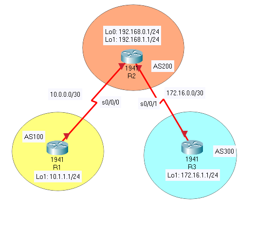

# BGP


Packet tracer supports only eBGP. (not iBGP)

```
**R1**
config t
int s0/0/0
ip address 10.0.0.1 255.255.255.252
exit
int lo101
ip address10.1.1.1 255.255.255.255

router bgp 100 # Canada has 4 autonomous system. USA - 36
network 10.1.1.0 mask 255.255.255.0
neighbor 10.0.0.2 remote-as 200

**R2**
int s0/0/0 
ip address 10.0.0.2 255.255.255.252
no shut
exit
int s0/0/1
ip add 172.16.0.1 255.255.255.252
no shut
exit
int lo100 
ip address 192.168.0.1 255.255.255.255
exit
int lo101
ip address 192.168.1.1 255.255.255.255
exit

router bgp 200
network 192.168.0.0 mask 255.255.255.255
network 192.168.1.0 mask 255.255.255.255
neighbor 10.0.0.1 remote-as 100
neighbor172.16.0.2 remote-as 300
show ip route

**R3**

int s0/0/1
ip address 172.16.0.2 255.255.255.252
no shut
intlo101 
ip address 172.16.1.1 255.255.255.255
exit
router bgp 300
network 172.16.1.0 mask 255.255.255.255
neighbot 172.16.0.1 remote-as 200
show ip route
```


