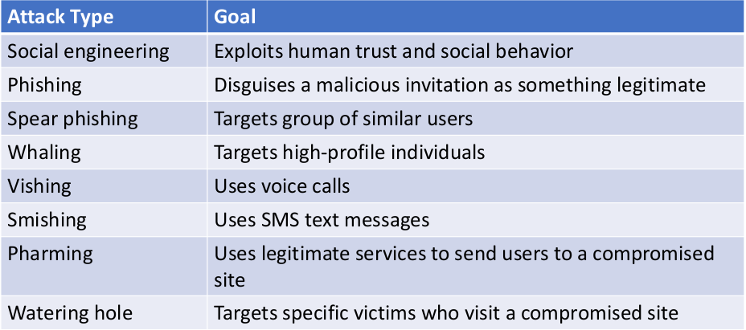

# CCNA_security
Password alternatives - multifactor authentication, certificates, and biometrics

Security pyramid - Integrity, avaialbility, confidentiality.

Spoofing Attack is when an attacker impersonates an authorized device or user to steal data

DOS attack is when perpetrator seeks to make a machine or network resource unavailable.

Reflection attack is a method of attacking a challenge–response authentication system  to trick the target into providing the answer to its own challenge.




username user password pass1  # password is not encrypted
if you want to change clear text password in the running-config, do this command
`service password-encryption`
username user secret pass1        # password IS settup encrypted right of the bet

Firewall can :
- filter on src and dst ip
- identify apps by tcp/udp ports
- L7 firewalls can watch application flow
- perform web-filtering
- perform statefull packet inspection

A stateful firewall maintains context across all its current sessions, rather than treating each packet as an isolated entity, as is the case with a stateless firewall. 

IPS usese a database of exploit signatures.

Switchport Security
• Ability to control access to a switchport
• Filtering based on source MAC address

Switchport Security types: static, dynamic, sticky.

Switchport Security violation: how switch reacts in the viations of established limits: protect, resctrict, shutdown (err-disable state).

1. interface interface_id
2. switchport mode access
3. switchport port-security
4. switchport port-security maximum value
5. switchport port-security violation {restrict | shutdown} 
6. switchport port-security limit rate invalid-source-mac
7. switchport port-security mac-address mac_address 
8. switchport port-security mac-address sticky
9. show port-security address  interface interface_id 
10. show port-security address

```
Switch# configure terminal
Enter configuration commands, one per line.  End with CNTL/Z.
Switch(config)# interface fastethernet 3/12
Switch(config-if)# switchport mode access
Switch(config-if)# switchport port-security
Switch(config-if)# switchport port-security maximum 5
Switch(config-if)# switchport port-security mac-address sticky
Switch(config-if)# end
Switch# show port-security interface fastethernet 3/12
Port Security              :Enabled
Port Status                :Secure-up
Violation Mode             :Shutdown
Aging Time                 :0
Aging Type                 :Absolute
SecureStatic Address Aging :Enabled
Maximum MAC Addresses      :5
Total MAC Addresses        :0
Configured MAC Addresses   :0
Sticky MAC Addresses       :11
Last Source Address        :0000.0000.0401
Security Violation Count   :0
```


