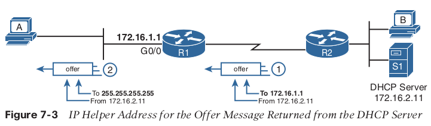

# DHCP
DHCP uses the following four messages between the client and server. (Also, as a way to
help remember the messages, note that the first letters spell DORA):
Discover: Sent by the DHCP client to find a willing DHCP server
Offer: Sent by a DHCP server to offer to lease to that client a specific IP address (and
inform the client of its other parameters)
Request: Sent by the DHCP client to ask the server to lease the IPv4 address listed in the
Offer message
Acknowledgment: Sent by the DHCP server to assign the address and to list the mask,
default router, and DNS server IP addresses

The DHCP relay feature must be configured for any router interface that connects to a subnet where
■ DHCP clients exist in the subnet
■ DHCP servers do not exist in the subnet


To enable DHCP RELAY, use command:
ip helper-address 172.16.2.11

snooping

```
ip dhcp snooping
ip dhcp snooping vla1 # first 2 commands to activate snooping
int g0/2
ip dhcp snooping trust
# also check if vlan 1 is up and running
show ip dhcp snooping
show ip dhcp snooping binding
show ip dhcp snooping database
```

DAI (Dynamic arp inspection)

```
ip arp inspection vlan 1
int gi0/2
ip arp inspection trust
show ip arp inspection
ip arp inspection validate src-mac {dst-mac ip}

```


