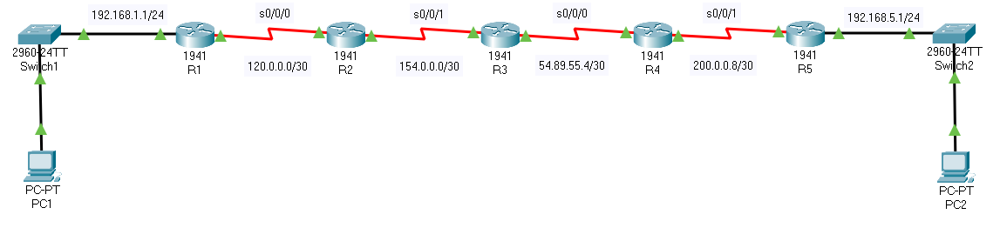

# GRE

+++++++++++R1++++++++++

ip route 0.0.0.0 0.0.0.0 s0/0/0

interface tunnel 0
ip address 10.0.0.1 255.255.255.252
tunnel mode gre ip
tunnel source s0/0/0
tunnel destination 200.0.0.10
exit
router eigrp 100
eigrp router-id 1.1.1.1
no auto-summary
network 192.168.1.0
network 10.0.0.
end
copy run star

++++++++++++++++R5++++++++++++++++

ip router 0.0.0.0 0.0.0.0 s/0/01
interface tunnel 0  # tunnel number does NOT matter
ip address 10.0.0.2 255.255255.252
tunnel mode gre ip
tunnel source s0/0/1
tunnel destination 120.0.0.1
exit
router eigrp router-id 5.5.5.5
no auto-summary
network 192.168.5.0
netowkr 10.0.0.0
copy run star