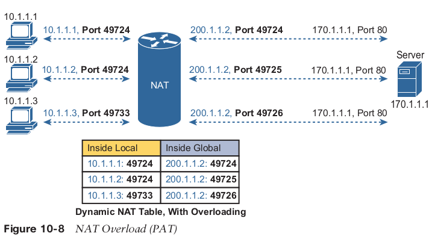
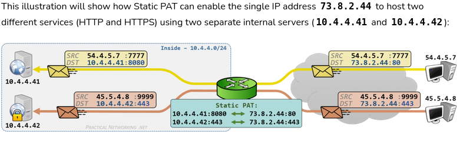
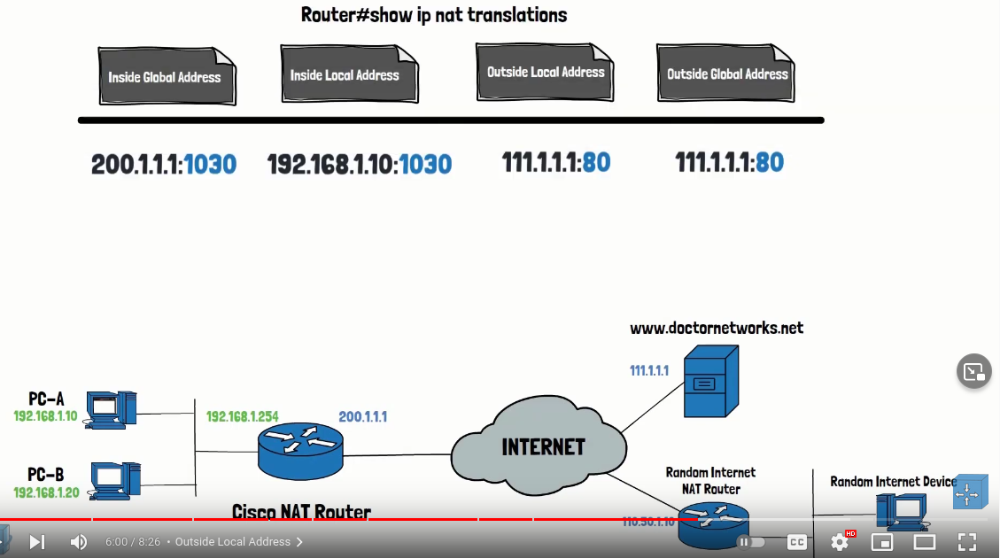
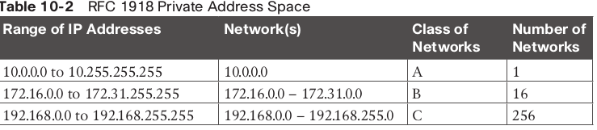

# NAT
NAT is used when you need public IP or to merge to intranets with duplicated IPs.
NAT , defined in RFC 3022, allows a host that does not have a valid, registered, globally unique IP address to communicate with other hosts through the Internet.

Types of NAT • Static NAT • Dynamic NAT (required 1 public for each extrenal conver.) • Overloading (lots of internal addresses to a single outside address)

Overloading also known as PAT (Port address Translation), because each port is mapped to diff. port.
The NAT router keeps a NAT table entry for every unique combination of inside local IP address and port, 
with translation to the inside global address and a unique port number associated with the inside global address.

EXAMPLE


**STATIC PAT**
One specific use case for **Static PAT **is to use a single Public IP address to host multiple services on different internal servers. 
This is in contrast with a Static NAT which would only allow you to use a single Public IP address to host multiple services on the same server.




Cisco uses the term inside local for the private IP addresses in this example and inside global for the public IP addresses.
Most of the time outside local and outside global are the same. 

Dynamic NAT uses NAT pool for provide one-to-one translation.


CIDR allow route aggregation or route summarization. These route summaries greatly reduce the size of routing tables in Internet routers
The second major CIDR feature allows RIRs and ISPs to reduce waste by assigning a subset of a classful network to a single customer.



Step 1. Use the ip nat inside command in interface configuration mode to configure interfaces to be in the inside part of the NAT design.
Step 2. Use the ip nat outside command in interface configuration mode to configure interfaces to be in the outside part of the NAT design.
Step 3. Use the ip nat inside source static inside-local inside-global command in global configuration mode to configure the static mappings.

STATIC
```
ip nat inside source static 10.1.1.1 170.168.2.3
ip nat inside source static 10.1.1.2 170.168.2.4
#this is static table translation
show ip nat translations
BDR-RTR(config)#interface gi0/0
BDR-RTR(config-if)#ip nat inside
BDR-RTR(config-if)#exit
BDR-RTR(config)#int s0/0/0
BDR-RTR(config-if)#ip nat outside
```

DYNAMIC
```
access-list 42 permit 10.1.1.0 0.0.0.255
ip nat pool pool_name 170.168.2.3 170.168.2.5 netmask 255.255.255.0
ip nat inside source list 42 pool pool_name
int Gi0/0
ip nat inside
int s0/0/0
ip nat outside
show ip nat translations
show ip nat statistics
```

ONE IP PAT
```
(config)# access-list 100 permit ip 192.168.0.0 0.0.0.255 any
(config)# ip nat inside source list 100 interface serial 0/0 overload
R1# configure terminal
R1(config)# interface fastethernet0/0
R1(config-if)# ip nat inside
R1(config-if)# interface serial0/0
R1(config-if)# ip nat outside 
```
One can also create pool for PAT:
ip access-list standard RUFFLES
permit 10.1.1.0 0.0.0.255
exit
ip nat pool DORITOS 170.168.2.3 170.168.2.4 netmask 255.255.255.0
ip nat inside source list RUFFLES pool DORITOS overload


