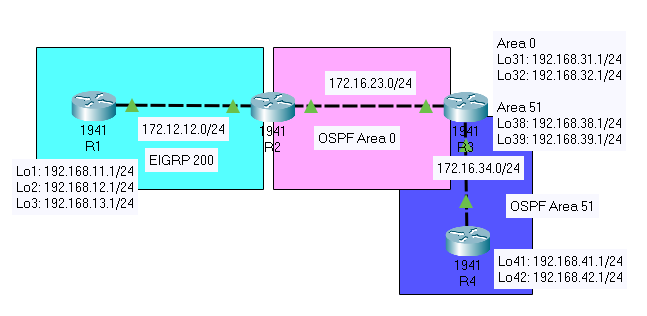

# WAN_redistribution

enable 
config t
++++++++++++++++++R1+++++++++

router eigrp 200   # this number DOES matter, unlike ospf number
no auto-summary
network 172.12.12.0 0.0.0.255
network 192.168.11.0
network 192.168.12.0
network 192.168.13.0
copy run star

+++++++++++++++++++++R2+++++++++++
en
config t
router eigrp 200
network 172.12.12.0 0.0.0.255 
network 172.16.23.0 0.0.0.255
exit
router ospf 2 
router-id 2.2.2.2
network 172.12.12.0 0.0.0.255 area 0
network 172.16.23.0 0.0.0.255 area 0
end

++++++++++++++++R3++++++++++++++++
+area border router (ABR)

router ospf 3
router-id 3.3.3.3
network 172.16.23.0 0.0.0.255 area 0
network 192.168.31.0 0.0.0.0 area 0
network 192.168.32.0 0.0.0.0 area 0

network 172.16.34.0 0.0.0.255 area 51
network 192.168.38.0. 0.0.0.255 area 51
network 192.168.39.0. 0.0.0.255 area 51

copy run star

+++++++++++++R4+++++++++
router ospf 4
router-id 4.4.4.4
network 172.16.34.0 0.0.0.255 area 51
network 192.168.41.0.0.0.255 area 51
network 192.168.42.0.0.0.255 area 51
end
copy run star

+++++++++++++R2+++++++++++
router ospf 2
redistribute eigrp 200 metric 100 metric-type 1 subnets

router eigrp 200
resitribute ospf 2 metrixc 50 33 255 1 1500

