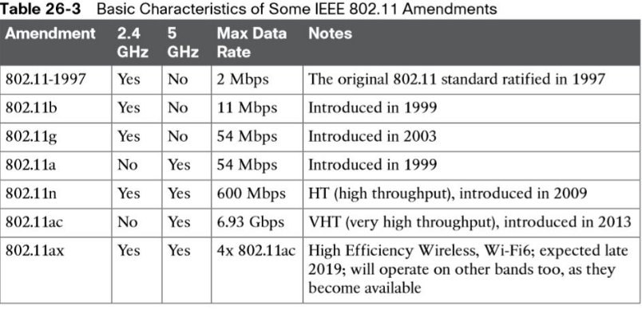
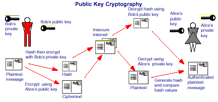
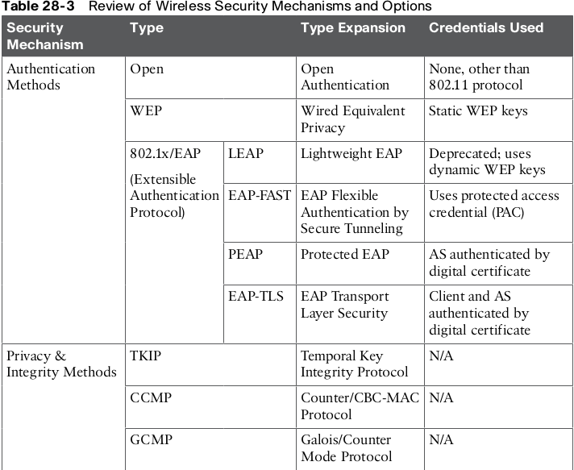

# WIRELESS
Wireless communication takes place over free space through the use of radio frequency (RF) signals.
In 802.11 WLAN all the hosts must operate in half-duplex mode.

At the most basic level, there is no control over the number of devices that can transmit and receive frames.

basic service set (BSS) is a wireless access point (AP). 
BSS identifier (BSSID) that is based on the AP’s own radio MAC address.

AP - An access point is a device that creates a wireless local area network and acts as a portal for devices to connect.

SSID - means (Service Set Identifier) and represents the name of your wireless network in string format in, most likely, use of ascii characters only. 

BSSID -  is the MAC address of the access point radio for that service set. 

A wireless distribution system (WDS) is a system enabling the wireless interconnection of access points in  802.11 network.

An extended service set (ESS) is one or more interconnected basic service sets (BSSs) and their associated LANs.  This allows multiple APs to share a wireless
service.

ad-hoc - Two hosts communicate directly.

Wireless repeater is a device that allows to extend range of the AP. 

Extended Service coverege - use of multyple access points 

Autonomous AP Architecture - it's a setup that has stand-alone APs that operates without help of controller.
In this cast every AP needs management IP.

Trunk port is created between access point and router.

Layers : Core, Distribution and Access. 

We can centrally manage our APs with a few different solutions
• On-Prem Wireless LAN Controller(s)
• Cloud-Based LAN Controller

All control is handled by the WLC. In that case AP becoming lightweight AP. LWAP.

CAPWAP (Control and Provisioning of Wireless Access Points) is a protocol that enables an access controller (AC) to manage a collection of wireless termination points.

Cisco AP Modes
• Most Cisco APs can operate in either autonomous mode or lightweight.
• There are special-purpose modes for lightweight APs as well
1. Local – Default. Offer one or more BSSes for clients to connect to
2. Monitor – No transmitting... it just ... Watches. Listens. Like a freak.
3. FlexConnect – Allows dynamic flipping between SSID and VLAN when WLC is down
4. Sniffer – It sniffs traffic. Similar to monitor, but monitor mode actively checks for IDS events, rogue APs and monitors hosts (or stations)

**-----------------------SECURING WIRELESS---------------------**

A message integrity check (MIC) is a security tool that can protect against data tampering.
Hash function that combines all the bytes in the message with a secret key and produces a message digest that is difficult to reverse.

The original 802.11 authentication methods: open authentication and WEP.

Wired Equivalent Privacy (WEP) - is a security algorithm for  wireless networks thaCisco controllers support a maximum of 512 WLANs, but only 16 of them can be active-
ly configured on an AP.t uses RC4 cipher (meaning shared one key is used).
WEP key is used to authentication as well by sending challenge phrases to client.
40 or 104 bits long key. OR 10 or 26 hex digits.

Extensible Authentication Protocol (EAP). is an authentication framework that is used in local area networks (LANs).
1. Supplicant: The client device that is requesting access. 
2. Authenticator: The network device that provides access to the network (usually a wireless LAN controller [WLC])
3.Authentication server (AS): The device that takes user or client credentials and permits or denies network access based on a user database and policies (usually a RADIUS server)
THERE ARE MANY AEP METHONDS: Lightweight EAP (LEAP), AEP-FAST (using TLS tunnel), PEAP (use of certificate), EAP-TLS(most secured authenrtication method).

TKIP (Temporal Key Integrity Protocol) is an encryption protocol in wireless networking. deprecated nowdays.
MIC - hashing algorithm.

The Counter/CBC-MAC Protocol (CCMP) is an encryption protocol that forms at 802.11i.
It consists of AES and CBC-MAC

The Advanced Encryption Standard (AES) is the current encryption algorithm adopted by
U.S. National Institute of Standards and Technology (NIST) and the U.S. government.

The Galois/Counter Mode Protocol (GCMP) is a robust authenticated encryption.
Consists of two algorithms: AES and Galois Message Authentication Code (GMAC).

3 wifi certification: WPA, WPA2, and WPA3.
WPA based on TKIP. WPA2 - AES and CCMP. WPA3 - AES and GCMP. 

personal mode and enterprise mode, respectively. With personal mode, a key string must
be shared or configured on every client and AP before the clients can connect to the wireless
network.

 TACACS+ or RADIUS are authentication, authorization, and accounting (AAA) servers.
 
Wireless controller interfaces are logical connections made internally within the controller.

 WLC Ports
■ Service port: Used for out-of-band management, system recovery, and initial boot 
■ Distribution system port: Used for all normal AP and management traffic
■ Console port: Used for out-of-band management, system recovery
■ Redundancy port: Used to connect to a peer controller for high availability.

Cisco controllers interface types:
■ Management interface: Used for normal management traffic, such as RADIUS user authentication.
■ Redundancy management: The management IP address of a redundant WLC that is part of a high availability pair of controllers.
■ Virtual interface: IP address facing wireless clients when the controller is relaying client
DHCP requests, performing client web authentication, and supporting client mobility.
■ Service port interface: Bound to the service port and used for out-of-band management.
■ Dynamic interface: Used to connect a VLAN to a WLAN.

Cisco controllers support a maximum of 512 WLANs, but only 16 of them can be actively configured on an AP.

