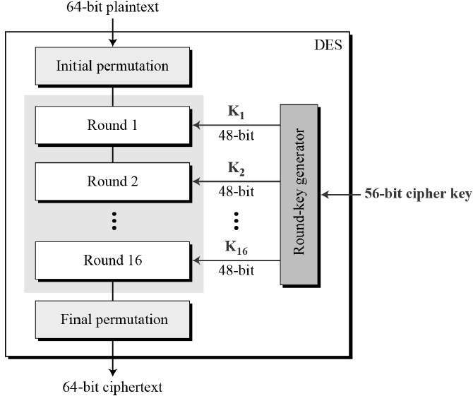

# encryption

**DES and triple DES**
DES is a block cipher and encrypts data in blocks of size of 64 bits each, 
which means 64 bits of plain text goes as the input to DES, which produces 64 bits of ciphertext. 
The same algorithm and key are used for encryption and decryption

