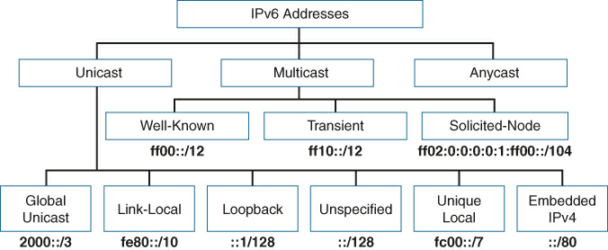
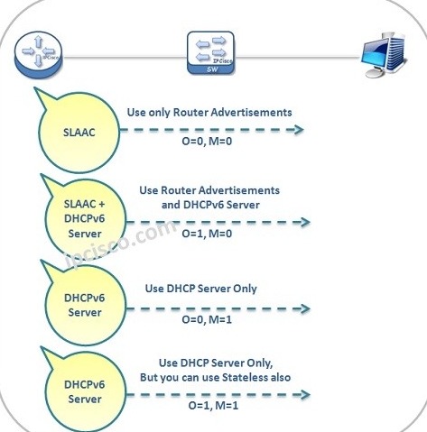
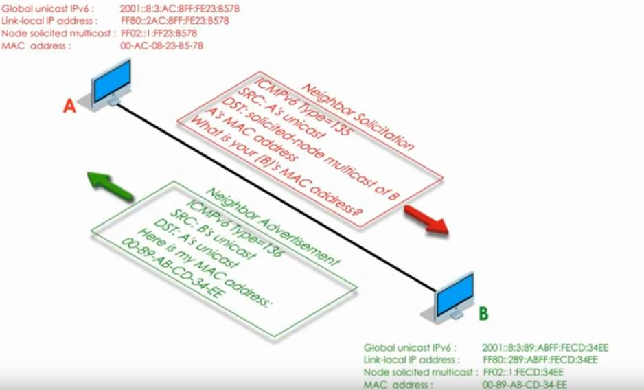

# ipv6
ipv6 is next generation layer 3 protocol/address of  128  that is represented in Hex (base 16) form. Full length is 8 sets of 4 hexadecimal digits (or 16 bits block).

ipv6:
- use hexidecimal form which saves room representing data.
- ipv6 uses more modern CIDR notation instead of mask to define the network
- ipv6 is using a bit simplified, henced more efficient header.

Communication Methods:
• Dual Stack Method - running both IPv4 and IPv6.
• Tunneling method
• NAT protocol Translation

in 2019, IANA considered all RIRs except AFRINIC to have exhausted their supply of IPv4 addresses.

Network Address Translation (NAT) and classless interdomain routing (CIDR) helped extend IPv4’s life another couple of decades.

OSPF version 3, was created to support IPv6.

Two basic rules let you, or any computer, shorten or abbreviate an IPv6 address:
    1. Inside each quartet of four hex digits, remove the leading 0s (0s on the left side of the quartet) in the three positions on the left. (Note: at this step, a quartet of 0000 will
        leave a single 0.)
    2. Find any string of two or more consecutive quartets of all hex 0s, and replace that
        set of quartets with a double colon (::). The :: means “two or more quartets of all 0s.”
        However, you can use :: only once in a single address because otherwise the exact
        IPv6 might not be clear.
        
The prefix length defines how many bits of the IPv6 address define the IPv6 prefix
IPv6 prefix is subnet ID.
If the prefix length is /P, use these rules:
1. Copy the first P bits.
2. Change the rest of the bits to 0. 

(A prefix length is a multiple of 4)

IPv6 does not use any concept like the classful network concept used by IPv4.

Addressing: global unicast(similar to public in v4) OR unique local IPv6 (similar to private v4)

Global routing prefix - reserved block of ipv6 address.

**IPV6 TYPES**

Global unicast 2 or 3 (originally); all not otherwise reserved (today)
Unique local unicast (unique local addresses begin with hex FD) 
All hosts multicast FF02::1
All routers multicast FF02::2
Routing protocol multicasts Various
Solicited-node multicast FF02::1:FF /104
Link local FE80 (special address that is used when protocol's messages needs to stay within the local LAN. Can't be routed through router)


**enabling IPV6 in router!!!!!!!!!!**
```
>config t
>ipv6 unicast-routing
>do sh ipv6 int br
>interface Gi0/0/0
>ipv6 address AA::1/64
>no shutdown
>do show ipv6 int br
```

Genereting EUI-64 IPV6 address(from left to right):
1) First goes 64 bits of the IPV6 with padded 0s , if nessessary to make complete 64 bits. 
2) 7-th bit (OR 3-D bit of the 2-D hex digit in  first quartet ) of MAC address is inverted.
3) Additional static 16 bits in the hex form FFFE is inserted/ijected in the middle of the MAC.


IPV6 can be configured:
-statically, along with the prefix length, default router, and  (DNS) IPv6 addresses. 
-dynamically:
    1.using either Dynamic Host Configuration Protocol (DHCP) or 
    2. a built-in IPv6 mechanism called Stateless Address Autoconfiguration (SLAAC).
    
**Configuring router's interface using EUI-64**
```
ipv6 unicast-routing
interface Gi0/0
ipv6 address 2001:DB8:1111:1::/64 eui-64  # using prefix only. NOT FULL IPV6
do show ipv6 interface br
```

When you use EUI-64, the address value in the ipv6 address command should be the prefix, not the full 128-bit IPv6 address.

Cisco routers support two ways for the router interface to dynamically learn an IPv6 address to use:
■ Stateful DHCP (command is **ipv6 address dhcp**)
■ Stateless Address Autoconfiguration (SLAAC) (command is **ipv6 address autoconfig)**

Cisco uses such tecnique to genereate link-local ipv6 address
first 64 bits start with FE80 and extra 0s padded from the right to complete full 64 
PLUS EUI-64 portion

multicast is the message that is sent to group of destination computers simultaneously. 

Anycast is the message that is sent to one out of group of computers that is calculated as the most closest from the requester. 
Used to reduce latency and as a load-balance teknique. 

**configure anycast on the router:**
```
>interface gigabitEthernet 0/0
>R1(config-if)# ipv6 address 2001:1:1:1::1/64     #unicast
>R1(config-if)# ipv6 address 2001:1:1:2::99/128 anycast    #anycast
```

OSPFv3 uses IPv6 multicast addresses FF02::5 and FF02::6

**------------------------------IPV6 ROUTING--------------------------------**

routes : 
1) connected(represent route connected to the interface ) and local(host route for specific address with prefic 128). 
2) static 
3) dynamic with help of OSPF

To add static route
```
> conf t
> ipv6 unicast-routing
>interface Gi0/1
>ipv6 route 2001:DB8:1111:2::/64 <some_interface> OR ipv6 route 2001:DB8:1111:2::/64 <next_hop_id>
```
When using link local address for routing , both link-local ip AND interface name must ne used
>ipv6 route 2001:db8:1111:2::/64 ***S0/0/0 FE80::FF:FE00:2***

The default route is the route used by router to forward packet in case whenmatches no other ipv6 routes.
If default route is NOT setup, packets are discarded.

ipv6 route ::/0 S0/0/1   # default route has been established

static host routes—that is, a route to a single host IP address.
`ipv6 route 2001:db8:1111:2::22/128 S0/0/0 FE80::FF:FE00:2`

Floating static route is the route with specificly established by engineer administrative distance in order to alter priority of chosen route 
in case when more than 1 route exists between 2 nodes. 

Connected routes 0
Static routes 1
NDP 2
EIGRP 90
OSPF 110
RIP 120
Unknown or unbelievable 255

The term DAD refers to the function, but the function uses NDP NS and NA messages.
Basically, a host sends an NS message for its own IPv6 address.



Neighbor Discovery Protocol (NDP), a part of ICMPv6, performs similar to ARP function in IPv4
Neighbor Solicitation (NS) acts like ARP request in IPV4. The NS message is sent to the solicited-node multicast address.
Neighbor Advertisement (NA) like an IPv4 ARP Reply. This message lists the sender’s IPv6 and MAC addresses.

Router Solicitation (RS): This message is sent to the “all-IPv6-routers” local-scope multi-cast address of FF02::2
Router Advertisement (RA): This message, sent by the router, lists many facts, including the link-local IPv6 address of the router.

SLAAC (Stateless Address Autoconfiguration) - IPv6 alternative method (meaning different from DHCP) for IPv6  to dynamically choose an unused IPv6 address. 
STEPS: 
1. Learn the IPv6 prefix used on the link, from any router, using NDP RS/RA messages.
2. Build an address from the prefix plus an interface ID, chosen either by using EUI-64
rules or as a random value.
3. Before using the address, first use DAD to make sure that no other host is already using the same address.




what is the node solicited multicast address for the IPV6 address b::54e1:daa1/64, Hint: RFC defined range is FF02::1::FF ?
FF02::1:FFe1:daa1

What is the EUI- 64 based address for given MAC address 0090:2716:FD0F and IPV6 prefix - 2001:DB8::/64?
2001:DB8::0290:27FF:FE16:FD0F/64

A BSS can be connected to a production network via the Distribution System
true

The Cisco AP mode – ‘FlexConnect’ Allows dynamic flipping between SSID and VLAN when WLC is down
true


