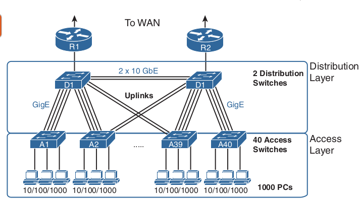
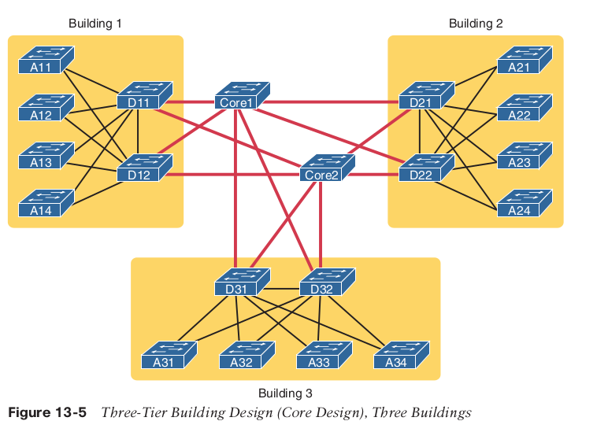
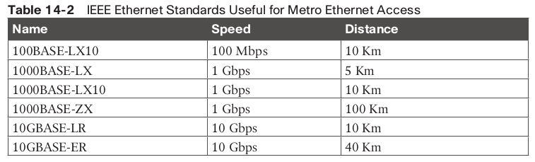
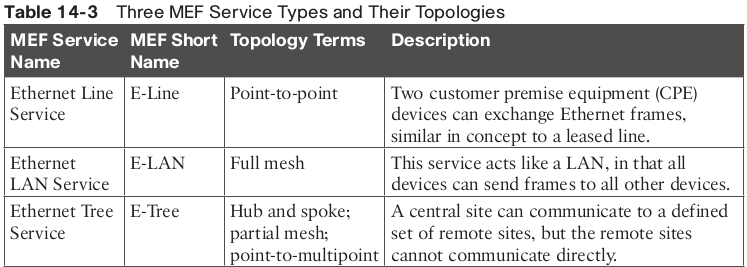
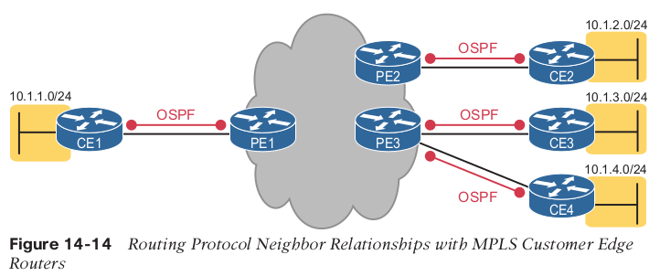

# network_architecture

Two-tier campus LAN:
- The design uses a partial mesh of links between access and distribution switches.
- The end-user and server devices connect directly to access layer switches.

Three-tier campus LAN
- The design uses a partial mesh of links between access and distribution switches.
- The design uses a partial mesh of links between the distribution and core switches.

The term campus LAN refers to the LAN created to support the devices in a building or in multiple buildings in somewhat close proximity to one another.

Cisco uses three terms to describe the role of each switch in a campus design: access, distribution, and core.

(access) - forwards traffic from user devices and the rest of the LAN
Distribution and core  - forwards traffic betwee other LAN switches
Distribution switches provide a path through which the access switches can forward traffic to each other.
By design, each of the access switches connects to at least one distribution switch,  typically to two distribution switches for redundancy.

The following list summarizes the terms that describe the roles of campus switches: 
■ Access: Provides a connection point (access) for end-user devices. Does not forward frames between two other access switches under normal circumstances.
■ Distribution: Provides an aggregation point for access switches, providing connectivity to the rest of the devices in the LAN, 
forwarding frames between switches, but not connecting directly to end-user devices.
■ Core: Aggregates distribution switches in very large campus LANs, providing very high forwarding rates for the larger volume of traffic due to the size of the network.

Topology design:
Star: A design in which one central device connects to several others, so that if you drew the
links out in all directions, the design would look like a star with light shining in all directions.

Full mesh: For any set of network nodes, a design that connects a link between each pair of nodes.

Partial mesh: For any set of network nodes, a design that connects a link between some pairs of nodes, but not all. In other words, a mesh that is not a full mesh.

Hybrid: A design that combines topology design concepts into a larger (typically more complex) design.

Small Office/Home Office - SOHO.

Power over Ethernet (PoE) device supplies DC power over the Ethernet cable

Cloud computing - is the on-demand availability of computer system resources, especially data storage and computing power, without direct active management by the user.

   KVM - keyboard, video, mouse.
   
A VM— is a virtual environment that functions as a virtual computer with running  OS instance that was decoupled from the server hardware

The hypervisor manages and allocates resources to each VM.

A virtual switch is a software program that allows one virtual machine (VM) to communicate with another and outside world. 

Cloud service:
On-demand self-service: The IT consumer chooses when to start and stop using the ser-
vice, without any direct interaction with the provider of the service.
Broad network access: The service must be available from many types of devices and
over many types of networks (including the Internet).
Resource pooling: The provider creates a pool of resources (rather than dedicating spe-
cific servers for use only by certain consumers) and dynamically allocates resources from
that pool for each new request from a consumer.
Rapid elasticity: To the consumer, the resource pool appears to be unlimited (that is, it
expands quickly, so it is called elastic), and the requests for new service are filled quickly.
Measured service: The provider can measure the usage and report that usage to the con-
sumer, both for transparency and for billing.

With a private cloud, the cloud provider and the cloud consumer are part of the same com-
pany. With public cloud, the reverse is true: a public cloud provider offers services, selling
those services to consumers in other companies.

Infrastructure as a Service (IaaS) - cloud provider starts the VM, which boots the chosen OS. Most flexiable. 

With Software as a Service (SaaS) - he consumer receives a service with working software.
Meaning customer has no access to alter OS or hardware setting. 

Platform as a Service (PaaS) - delivers a framework for developers that they can build upon and use to create customized applications.
Developers can concentrate on building the software without having to worry about operating system

Pros cloud :
Agility
Migration
Distributed users:

Cons:
Security
Capacity
Quality of Service (QoS)
No WAN SLA

++++++++++++++++++++WAN++++++++++++++++++++++++++

 Metro Ethernet network is a metropolitan area network that is based on Ethernet standards. It is commonly used to connect subscribers to a larger service network
 
Point of presence - location of service provider.
User network interface - UNI - demarcation point between the responsibility of the service provider and the responsibility of the subscriber.

Multiprotocol Label Switching (MPLS) -  is data forwarding technology that increases the speed and controls the flow of network traffic.
With MPLS, data is directed through a path via labels instead of requiring complex lookups in a routing table at every stop.

While MPLS VPNs provide a Layer 3 service to customers, MPLS itself is sometimes called a Layer 2.5 protocol 
because it adds the MPLS header between the data-link header (Layer 2) and the IP header (Layer 3).

Customer Edge CE - router of the client of the MPLS Service Provider
Provider Edge PE - device the sits on the edge of the SP.

route redistribution - tranfer routes from one ruoting protocol to another.
MPLS uses Multiprotocol BGP (MPBGP).

digital subscriber line (DSL) - 

VPNs can provide important security features, such as the following:
■ Confidentiality (privacy): Preventing anyone in the middle of the Internet (man in the middle) from being able to read the data
■ Authentication: Verifying that the sender of the VPN packet is a legitimate device and not a device used by an attacker
■ Data integrity: Verifying that the packet was not changed as the packet transited the
Internet
■ Anti-replay: Preventing a man in the middle from copying and later replaying the pack-
ets sent by a legitimate user, for the purpose of appearing to be a legitimate user

 IPsec is protocol that often used to set up VPNs, and it works by encrypting IP packets, along with authenticating the source where the packets come from.

