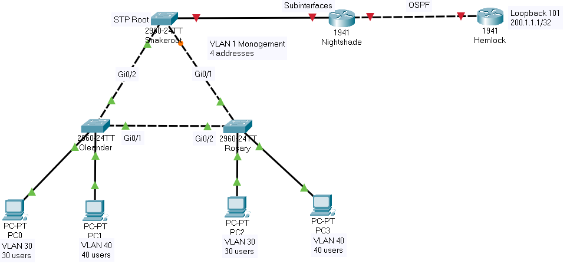

# project_x2

housekeeping. switch snakeroot

enable
config terminal
hostname snakeroot
username chris password 123
enable secret cisco
ip domain-name chrisco.com
crypto key generate rsa modulus 4096
line console 0
logging synchronous <- disables prompt cutoff
login local
password ciscoconsole
exec-timeout 15 30
exit
line vty 0 15
login local
exec timeout 8 15
transport input ssh
exit
interface vlan 1
ip address 192.168.200.98 255.255.255.248
no shutdown
exit

VLANS

vlan 30 
name Abrus
exit
vlan 40
name Precatorius
exit
interface range gi0/1 - 2
switchport mode trunk
switchport trunk allowed vlan1,30,40
exit
interface fa0/1
switchport mode trunk
switchport trunk allowed vlan 1,30,40 (switchport trunk allowed vlan add 50)
exit

spanning tree

spanning-tree vlan 1 root primary
spanning-tree vlan 30 root primary
spanning-tree vlan 40 root primary
end
copy running-config startup-config

show spanning-tree vlan 1 ================== ieee -> stp -> pvst

show vlan brief
I dont take the best notes
but those were all the commands he entered, with the exception of "show spanning-tree vlan 1 ================== ieee -> stp -> pvst"

**switch oleander**
config t
hostname oleander
username roman password cisco123
enable secret cisco
ip domain-name nikita.com
crypto key generate rsa general-keys modulus 2048
line console 0
logging synchronnous
login local
exec-timeout 15 30
exit
vty 0 15
transport input ssh
exec-timeout 8 15
interface vlan 1
ip address 192.168.200.99 255.255.255.248
no shutdown
exit

vlan 30 
name Abrus
exit
vlan 40
name Precatorius
exit

--interfaces and port security--

(config)
int f0/3
switchport mode access
switchport access vlan 30
switchport port-security
switchport port-security mac-address 0001.43cd.1058
exit
int f0/4
switchport mode access
switchport access vlan 40
switchport port-security
switchport port-security mac-address 0060.5c29.64AB
show port-security
exit
interface range gi0/1-2
switchport mode trunk
switchport trunk aloowed vlan 1,30,40
end
copy running-startup-config

**--housekeeping-- ROSEMARY**

config t
hostname rosary
username roman password cisco123
enable secret cisco
ip domain-name nikita.com
crypto key generate rsa general-keys modulus 2048
line console 0
logging synchronnous
login local
exec-timeout 15 30
exit
vty 0 15
transport input ssh
exec-timeout 8 15
interface vlan 1
ip address 192.168.200.100 255.255.255.248
no shutdown
exit

--interfaces--
HOUSEKEEPING

vlan 30 
name Abrus
exit
vlan 40
name Precatorius
exit

int f0/3
switchport mode access
switchport access vlan 30
switchport port-security
switchport port-security mac-address 0001.64c3.2967
exit
int f0/4
switchport mode access
switchport access vlan 40
switchport port-security
switchport port-security mac-address 0001.4276.693C
show port-security
exit
interface range gi0/1-2
switchport mode trunk
switchport trunk aloowed vlan 1,30,40
end
copy running-startup-config

--verification

show spanning-tree vlan 1
show spanning-tree vlan 30
show spanning-tree vlan 40

**--router -- **

config t
hostname rosary
username roman password cisco123
enable secret cisco
ip domain-name nikita.com
crypto key generate rsa general-keys modulus 2048
line console 0
logging synchronnous
login local
exec-timeout 15 30
exit
line vty 0 4
login input
transport input ssh
exec-timeout 8 15
exit

--interfaces
interface gi0/0.1
encapsulation dot1q 1
ip address 192.168.200.97 255.255.255.248
exit
int gi0/0.30
encapsulation dot1q 1
ip address 192.168.200.65 255.255.255.224
exit
int gi0/0.30
encapsulation dot1q 1
ip address 192.168.200.1 255.255.255.192
exit
int go0/0
no shutdown
exit

int gi0/1
ip address 192.168.200.105 255.255.255.252
no shutdown
exit

router ospf 1000
router-id 1.1.1.1
network 192.168.200.96 0.0.0.7 area 0 # 29 network
network 192.168.200.64 0.0.0.31 area 0 # 27 network
network 192.168.200.0 0.0.0.63 area 0 # this is 26 network
network 192.168.200.104 0.0.0.3 area 0 # network 30

**--router-- HEMLOCK--**
hostname hemlock
username roman password cisco123
enable secret cisco
ip domain-name roman.com
crypto key generate rsa general-keys modulus 2048
line console 0
logging synchronous
exec-timeout 15 30
login local
exit
line vty 0 4
login local
transport input ssh
eec-timeout 8 15
exit

--interfaces
 int gi0/0
 ip address 192.168.200.106 255.255.255.252
 no shutdown
exit
int lo101
ip address 200.1.1.1 255.255.255.255
exit
router ospf 2000
network 200.1.1.1 0.0.0.0 area 0
network 192.168.200.104 0.0.0.3 area 0
show ip protocols

