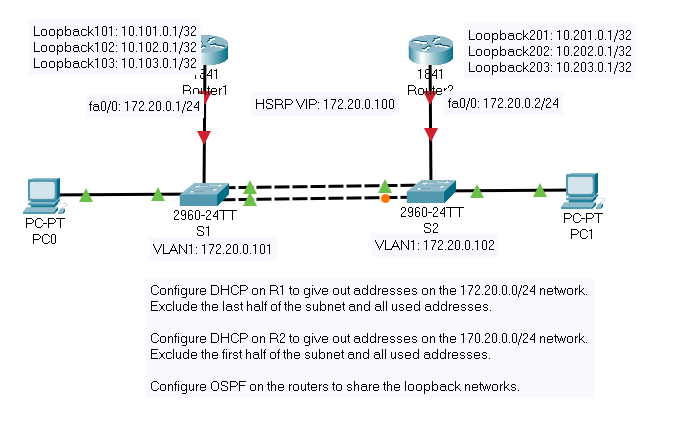

# project_x4

+++++++++++++SW1++++++++++++++
enable
conf t
hostname sw1
line con 0
logg sync
exit
no ip domain-l
ip domain-name roman.com
cryp jeys gen rsa gen mod 2048
line vty 0 15
trans inp ssh
login local
exit
username roman password cisco123
enable sec cisco

interface vlan 1
ip address 172.20.0.101 255.255.255.0
no shutdown
exit
in f0/3
switchport mode acc
swt port
swt port mac sticky
exit
int range fa0/1-2
channel-group 1 mode active # either LACP or PAgP   desirable<->auto for PAgP
exit
int po1
swi mode trunk
exit
copy run start # or you can `write memory`

+++++++++++++++SW2+++++++++++++++

channel-group 1 mode 
vlan 1
ip address 172.20.0.102. 255.255.255.0

--interfaces
ing fa0/3
switch mode access
swt port 
swit port mac sticky
int range fa0/1-2
channelgroup 1 mode passive
show show etherchannel summary
do show int trunk # trunk got formed automaticly
write memory

++++++++++++R1+++++++++++
--housekeeping--

int fa0/0 
ip add 172.20.0.1 255.255.255.0
no shutdown

int lo101
ip address 10.101.0.1 255.255.255.255
int lo102
ip address 10.102.0.1 255.255.255.255
int lo103
ip address 10.103.0.1 255.255.255.255

int fa0/1
standby version 2
standby 500 ip 172.20.0.100

--------------ospf------------------
router ospf 50000
network 172.20.0.0 0.0.0.255 area 0
network 10.101.0.1 0.0.0.0 area 0
network 10.102.0.1 0.0.0.0 area 0
network 10.103.0.1 0.0.0.0 area 0

ip dhcp pool HSRPOOL
network 172.20.0. 255.255.255.0
default 172.20.0.100
dns-server 8.8.8.8
exit
ip dhcp excluded-address 172.20.0.1 172.20.0.2 
ip dhcp excluded-address 172.20.0.100 172.20.0.102
ip dhcp excluded-address 172.20.0.125 172.20.0.254

wri mem

+++++++++++++++++++++r2++++++++++++++++
--housekeeping--

int lo201 
ip add 10.201.0.1 255.255.255.255
int lo202
ip add 10.202.0.1 255.255.255.255
int lo203
ip add 10.203.0.1 255.255.255.255
in fa0/0
ip address 172.20.0.2 255.255.255.0
no shutdown
standby version 2
standby 500 ip 172.20.0.100
exit

--ospf--

router ospf 50001
network 10.201.0.1 0.0.0.0 area 0
network 10.202.0.1 0.0.0.0 area 0
network 10.203.0.1 0.0.0.0 area 0
network 172.20.0.0 0.0.0.255 area 0

--dhcp--

ip dhcp pool HSRPPOOL
network 172.20.0.0 255.255.255.0
default 172.20.0.100
dns 8.8.8.8
exit
ip dhcp excluded 172.20.0.1 172.20.0.125
wri mem
show standby 
show ip dhcp binding
show ip ospf neighbor

