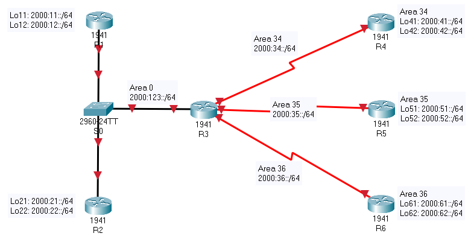

# project_x5

***OSPF***

---TEMPLATE---

enable
configure terminal
hostname R6
line console 0
logging synchronous
exit
no ip domain-lookup
ipv6 unicast-routing

*R1

Router>enable
Router#configure terminal
Router(config)#hostname R1
R1(config)#line console 0
R1(config-line)#logging synchronous
R1(config-line)#exit
R1(config)#no ip domain-lookup
R1(config)#ipv6 unicast-routing
R1(config)#int gi0/0
R1(config-if)#ipv6 address 2000:123::1/64
R1(config-if)#ip address 123.0.0.1 255.255.255.0
R1(config-if)#no shutdown
R1(config-if)#ipv6 ospf 1 area 0
R1(config-if)#ip ospf 1 area 0
R1(config)#int lo11
R1(config-if)#ipv6 address 2000:11::1/64
R1(config-if)#ip address 11.0.0.1 255.255.255.0
R1(config-if)#ipv6 ospf 1 area 0
R1(config-if)#ip ospf 1 area 0
R1(config-if)#no shutdown
R1(config)#int lo12
R1(config-if)#ipv6 address 2000:12::1/64
R1(config-if)#ipv6 ospf 1 area 0
R1(config-if)#ip address 12.0.0.1 255.255.255.0
R1(config-if)#ip ospf 1 area 0
R1(config-if)#exit
R1(config)#end
R1#copy run start

*R2

Router>enable
Router#configure terminal
Router(config)#hostname R2
R2(config)#line console 0
R2(config-line)#logging synchronous
R2(config-line)#exit
R2(config)#no ip domain-lookup
R2(config)#ipv6 unicast-routing
R2(config)#int gi0/0
R2(config-if)#ipv6 address 2000:123::2/64
R2(config-if)#ipv6 ospf 2 area 0
R2(config-if)#ip address 123.0.0.2 255.255.255.0
R2(config-if)#ip ospf 2 area 0
R2(config-if)#no shutdown
R2(config-if)#exit
R2(config)#int lo21
R2(config-if)#ipv6 address 2000:21::2/64
R2(config-if)#ipv6 ospf 2 area 0
R2(config-if)#ip address 21.0.0.2 255.255.255.0
R2(config-if)#ip ospf 2 area 0
R2(config-if)#exit
R2(config)#int lo22
R2(config-if)#ipv6 address 2000:22::2/64
R2(config-if)#ipv6 ospf 2 area 0
R2(config-if)#ip address 22.0.0.2 255.255.255.0
R2(config-if)#ip ospf 2 area 0
R2(config-if)#end
R2#copy run start
R2#show ipv6 route
O   2000:11::1/128 [110/1]
     via FE80::20B:BEFF:FEDC:EC01, GigabitEthernet0/0
O   2000:12::1/128 [110/1]
     via FE80::20B:BEFF:FEDC:EC01, GigabitEthernet0/0

R2#show ipv6 ospf neighbor

Neighbor ID     Pri   State           Dead Time   Interface ID  Int
123.0.0.1         1   FULL/DR         00:00:37    1             Gig0/0

R2#show ip route
     11.0.0.0/32 is subnetted, 1 subnets
O       11.0.0.1/32 [110/2] via 123.0.0.1, 00:03:32, GigabitEthernet0/0
     12.0.0.0/32 is subnetted, 1 subnets
O       12.0.0.1/32 [110/2] via 123.0.0.1, 00:03:32, GigabitEthernet0/0

*R3

Router>enable
Router#configure terminal
Router(config)#hostname R3
R3(config)#line console 0
R3(config-line)#logging synchronous
R3(config-line)#exit
R3(config)#no ip domain-lookup
R3(config)#ipv6 unicast-routing
R3(config)#int gi0/0
R3(config-if)#ipv6 address 2000:123::3/64
R3(config-if)#ipv6 ospf 3 area 0
R3(config-if)#ip address 123.0.0.3 255.255.255.0
R3(config-if)#no shutdown
R3(config-if)#ip ospf 3 area 0
R3(config-if)#exit
R3(config)#int s0/0/0
R3(config-if)#ipv6 address 2000:34::3/64
R3(config-if)#ip address 34.0.0.3 255.255.255.0
R3(config-if)#no shutdown
R3(config-if)#ipv6 ospf 3 area 34
R3(config-if)#ip ospf 3 area 34
R3(config-if)#exit
R3(config)#int s0/0/1
R3(config-if)#ipv6 address 2000:35::3/64
R3(config-if)#ip add 35.0.0.3 255.255.255.0
R3(config-if)#no sh
R3(config-if)#ipv6 ospf 3 area 35
R3(config-if)#ip ospf 3 area 35
R3(config-if)#exit
R3(config)#int s0/1/0
R3(config-if)#ipv6 address 2000:36::3/64
R3(config-if)#ip address 36.0.0.3 255.255.255.0
R3(config-if)#no sh
R3(config-if)#ipv6 ospf 3 area 36
R3(config-if)#ip ospf 3 area 36
R3(config-if)#end

*R4

Router>enable
Router#configure terminal
Router(config)#hostname R4
R4(config)#line console 0
R4(config-line)#logging synchronous
R4(config-line)#exit
R4(config)#no ip domain-lookup
R4(config)#ipv6 unicast-routing
R4(config)#ipv6 router ospf 4
R4(config-rtr)#router-id 4.4.4.4
R4(config)#int s0/0/0
R4(config-if)#ipv6 address 2000:34::4/64
R4(config-if)#ip address 34.0.0.4 255.255.255.0
R4(config-if)#no shutdown
R4(config-if)#ipv6 ospf 4 area 34
R4(config-if)#ip ospf 4 area 34
R4(config-if)#exit
R4(config)#int lo41
R4(config-if)#ipv6 address 2000:41::4/64
R4(config-if)#ip address 41.0.0.4 255.255.255.0
R4(config-if)#ipv6 ospf 4 area 34
R4(config-if)#ip ospf 4 area 34
R4(config-if)#exit
R4(config)#int lo42
R4(config-if)#ipv6 address 2000:42::4/64
R4(config-if)#ip add 42.0.0.4 255.255.255.0
R4(config-if)#ipv6 ospf 4 area 34
R4(config-if)#ip ospf 4 area 34
R4(config-if)#end
R4#copy run start

*R5

Router>enable
Router#configure terminal
Router(config)#hostname R5
R5(config)#line console 0
R5(config-line)#logging synchronous
R5(config-line)#exit
R5(config)#no ip domain-lookup
R5(config)#ipv6 unicast-routing
R5(config)#ipv6 router ospf 5
R5(config-rtr)#router-id 5.5.5.5
R5(config-rtr)#exit
R5(config)#int s0/0/1
R5(config-if)#ipv6 addre 2000:35::5/64
R5(config-if)#ip add 35.0.0.5 255.255.255.0
R5(config-if)#no sh
R5(config-if)#ipv6 ospf 5 area 35
R5(config-if)#ip ospf 5 area 35
R5(config-if)#exit
R5(config)#int lo51
R5(config-if)#ipv6 add 2000:51::5/64
R5(config-if)#ip add 51.0.0.5 255.255.255.0
R5(config-if)#ipv6 ospf 5 area 35
R5(config-if)#ip ospf 5 area 35
R5(config-if)#exit
R5(config)#int lo52
R5(config-if)#ipv6 add 2000:52::5/64
R5(config-if)#ip add 52.0.0.5 255.255.255.0
R5(config-if)#ipv6 ospf 5 area 35
R5(config-if)#ip ospf 5 area 35
R5(config-if)#end

*R6

Router>enable
Router#configure terminal
Router(config)#hostname R6
R6(config)#line console 0
R6(config-line)#logging synchronous
R6(config-line)#exit
R6(config)#no ip domain-lookup
R6(config)#ipv6 unicast-routing
R6(config)#ipv6 router ospf 6
R6(config-rtr)#router-id 6.6.6.6
R6(config-rtr)#exit
R6(config)#router ospf 6
R6(config-router)#router-id 6.6.6.6
R6(config-router)#exit
R6(config)#int s0/1/0
R6(config-if)#ipv6 addr 2000:36::6/64
R6(config-if)#ip add 36.0.0.6 255.255.255.0
R6(config-if)#no sh
R6(config-if)#ipv6 ospf 6 area 36
R6(config-if)#ip ospf 6 area 36
R6(config-if)#exit
R6(config)#int lo61
R6(config-if)#ipv6 add fd00:61::6/64
R6(config-if)#ip add 10.61.0.6 255.255.255.0
R6(config-if)#ipv6 ospf 6 area 36
R6(config-if)#ip ospf 6 area 36
R6(config)#int lo62
R6(config-if)#ipv6 add 2000:62::6/64
R6(config-if)#ip add 62.0.0.6 255.255.255.0
R6(config-if)#ipv6 ospf 6 area 36
R6(config-if)#ip ospf 6 area 36
R6(config-if)#end
