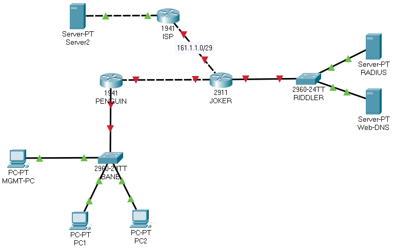

# project_x6

***SECURITY DAY***

---TEMPLATE---

en
conf t
host RIDDLER
username batman secret cisco123
username robin secret cisco123
enable secret cisco
service password-encryption
ip domain-name chrisco.com
crypto key gen rsa gen mod 2048
access-list 42 permit host 10.0.0.200
line con 0
logging sync
exec-tim 15
login local
exit
line vty 0 15
exec-timeout 10
login local
transport input ssh
access-class 42 in
exit

*BANE

---HOUSEKEEPING---

Switch>enable
Switch#conf t
Switch(config)#username batman password cisco123
Switch(config)#username robin secret cisco123
Switch(config)#enable secret cisco
Switch(config)#do show run | include secret
	enable secret 5 $1$mERr$hx5rVt7rPNoS4wqbXKX7m0
	username batgirl secret 5 $1$mERr$Qg3vEYkb44JQpQkxs99Mo.
	username robin secret 5 $1$mERr$5.a6P4JqbNiMX01usIfka/
BANE(config)#ip domain-name chrisco.com
BANE(config)#no ip domain-lookup
BANE(config)#crypto key gen rsa general mod 2048
BANE(config)#line con 0
BANE(config-line)#logging sync
BANE(config-line)#exec-timeout 15
BANE(config-line)#login local
BANE(config-line)#exit
BANE(config)#access-list 42 permit host 10.0.0.200
BANE(config)#line vty 0 15
BANE(config-line)#exec-timeout 10
BANE(config-line)#login local
BANE(config-line)#transport input ssh
BANE(config-line)#access-class 42 in
BANE(config-line)#exit
BANE(config)#int vlan 1
BANE(config-if)#ip add 10.0.0.254 255.255.255.0
BANE(config-if)#no sh
BANE(config-if)#exit

---INTERFACE CONFIGURATION---

BANE(config)#int range fa0/1 - 3
BANE(config-if-range)#switchport mode access
BANE(config-if-range)#switchport port-security
BANE(config-if-range)#exit
BANE(config)#int fa0/1
BANE(config-if)#switchport port-security mac-address sticky
BANE(config-if)#exit
BANE(config)#int fa0/2
BANE(config-if)#switchport port-security maximum 2
BANE(config-if)#switchport port-security violation restrict
BANE(config-if)#exit
BANE(config)#int fa0/3
BANE(config-if)#switchport port-security mac-address 0000.0000.0005
BANE(config-if)#exit

---DHCP SNOOPING---

BANE(config)#ip dhcp snooping
BANE(config)#ip dhcp snooping vlan 1
	! Oops, missed this command during the demo

BANE(config)#ip dhcp snooping information option allow-untrusted
	! Allows the snooping process to trust unknown IPs
	! Admittedly, this is a security hole, and as far as I can tell, only
	! sometimes required when you are using a relay-agent, or allowing
	! the switch to insert option 82 into the DHCP packet. 
	
BANE(config)#int fa0/1
BANE(config-if)#int gi0/1
BANE(config-if)#ip dhcp snooping trust
BANE(config-if)#exit
BANE(config)#int range fa0/4 - 24 , gi0/2
BANE(config-if-range)#switchport access vlan 666
BANE(config-if-range)#shutdown
BANE(config-if-range)#end
BANE#copy run start

*PENGUIN

Router>en
Router#conf t
Router(config)#host PENGUIN
PENGUIN(config)#username batman secret cisco123
PENGUIN(config)#username robin secret cisco123
PENGUIN(config)#enable secret cisco
PENGUIN(config)#service password-encryption
PENGUIN(config)#ip domain-name chrisco.com
PENGUIN(config)#crypto key gen rsa gen mod 2048
PENGUIN(config)#access-list 42 permit host 10.0.0.200
PENGUIN(config)#line con 0
PENGUIN(config-line)#logging sync
PENGUIN(config-line)#exec-tim 15
PENGUIN(config-line)#login local
PENGUIN(config-line)#exit
PENGUIN(config)#line vty 0 4
PENGUIN(config-line)#exec-timeout 10
PENGUIN(config-line)#login local
PENGUIN(config-line)#transport input ssh
PENGUIN(config-line)#access-class 42 in
PENGUIN(config-line)#exit
PENGUIN(config)#int gi0/1
PENGUIN(config-if)#ip add 10.0.0.1 255.255.255.0
PENGUIN(config-if)#ip helper-address 1.2.3.4
PENGUIN(config-if)#no shut
PENGUIN(config-if)#int gi0/0
PENGUIN(config-if)#ip add 10.0.1.9 255.255.255.252
PENGUIN(config-if)#no sh
PENGUIN(config-if)#exit
PENGUIN(config)#ip route 0.0.0.0 0.0.0.0 10.0.1.10

---ACLs---

1. Permit traffic from BANE LAN for RADIUS
2. Permit traffic from BANE LAN for DNS
3. Permit HTTPS to any

PENGUIN(config)#access-list 142 permit tcp 10.0.0.0 0.0.0.255 host 10.0.1.2 eq 1645
PENGUIN(config)#access-list 142 permit udp 10.0.0.0 0.0.0.255 host 10.0.1.2 eq 1645
PENGUIN(config)#access-list 142 permit tcp 10.0.0.0 0.0.0.255 host 10.0.1.3 eq 53
PENGUIN(config)#access-list 142 permit udp 10.0.0.0 0.0.0.255 host 10.0.1.3 eq 53
PENGUIN(config)#access-list 142 permit tcp 10.0.0.0 0.0.0.255 any eq 443
PENGUIN(config)#int gi0/1
PENGUIN(config-if)#ip access-group 142 in
PENGUIN(config-if)#end

*JOKER

---HOUSEKEEPING---

Router>en
Router#conf t
Router(config)#host JOKER
JOKER(config)#username batman secret cisco123
JOKER(config)#username robin secret cisco123
JOKER(config)#enable secret cisco
JOKER(config)#service password-encryption
JOKER(config)#ip domain-name chrisco.com
JOKER(config)#crypto key gen rsa gen mod 2048
JOKER(config)#access-list 42 permit host 10.0.0.200
JOKER(config)#line con 0
JOKER(config-line)#logging sync
JOKER(config-line)#exec-tim 15
JOKER(config-line)#login local
JOKER(config-line)#exit
JOKER(config)#line vty 0 4
JOKER(config-line)#exec-timeout 10
JOKER(config-line)#login local
JOKER(config-line)#transport input ssh
JOKER(config-line)#access-class 42 in
JOKER(config-line)#exit

---INTERFACES---

JOKER(config)#int gi0/0
JOKER(config-if)#ip add 10.0.1.10 255.255.255.252
JOKER(config-if)#ip nat inside
JOKER(config-if)#no shut
JOKER(config-if)#exit
JOKER(config)#int gi0/1
JOKER(config-if)#ip add 10.0.1.1 255.255.255.248
JOKER(config-if)#ip nat inside
JOKER(config-if)#no shut
JOKER(config-if)#exit
JOKER(config)#int gi0/2
JOKER(config-if)#ip add 161.1.1.2 255.255.255.248
JOKER(config-if)#ip nat outside
JOKER(config-if)#no shut
JOKER(config-if)#exit

---ROUTING---

JOKER(config)#ip route 10.0.0.0 255.255.255.0 10.0.1.9
JOKER(config)#ip route 0.0.0.0 0.0.0.0 161.1.1.1

---ACLs AND NAT---

JOKER(config)#access-list 152 permit ip 161.1.1.0 0.0.0.7 any
JOKER(config)#int gi0/2
JOKER(config-if)#ip access-group 152 out
JOKER(config-if)#exit
JOKER(config)#ip access-list standard NAT
JOKER(config-std-nacl)#deny 10.0.1.0 0.0.0.7	! Server network
JOKER(config-std-nacl)#deny 10.0.1.8 0.0.0.3	! PEN-JOK network
JOKER(config-std-nacl)#permit 10.0.0.0 0.0.0.255
JOKER(config-std-nacl)#25 deny host 10.0.0.254
JOKER(config-std-nacl)#exit

---DHCP---

JOKER(config)#ip dhcp excluded-address 10.0.0.200
JOKER(config)#ip dhcp excluded-address 10.0.0.254
JOKER(config)#ip dhcp relay information trust-all
	! Note: Missed this command in the demo as well.
	! Because the switch has snooping enabled, this adds in Option 82
	! into the DHCP packet. The router needs to understand that this
	! configuration is okay, and to allow (or trust) the DHCP relay packet.
	
JOKER(config)#ip dhcp pool BANE
JOKER(dhcp-config)#network 10.0.0.0 255.255.255.0
JOKER(dhcp-config)#default-router 10.0.0.1
JOKER(dhcp-config)#dns-server 10.0.1.3
JOKER(dhcp-config)#end
JOKER#copy run start

---RADIUS SERVER IP INFO---

IP  10.0.1.2
SM  255.255.255.248
DG  10.0.1.1
DNS 10.0.1.3

---RADIUS---

JOKER(config)#aaa new-model
JOKER(config)#radius-server host 10.0.1.2 auth-port 1645
JOKER(config)#aaa authentication enable default group radius
JOKER(config)#aaa authentication login default group radius local
JOKER(config)#radius-server key cisco123

*RIDDLER

Switch>en
Switch#conf t
Switch(config)#host RIDDLER
RIDDLER(config)#username batman secret cisco123
RIDDLER(config)#username robin secret cisco123
RIDDLER(config)#enable secret cisco
RIDDLER(config)#service password-encryption
RIDDLER(config)#ip domain-name chrisco.com
RIDDLER(config)#crypto key gen rsa gen mod 2048
RIDDLER(config)#access-list 42 permit host 10.0.0.200
RIDDLER(config)#line con 0
RIDDLER(config-line)#logging sync
RIDDLER(config-line)#exec-tim 15
RIDDLER(config-line)#login local
RIDDLER(config-line)#exit
RIDDLER(config)#line vty 0 15
RIDDLER(config-line)#exec-timeout 10
RIDDLER(config-line)#login local
RIDDLER(config-line)#transport input ssh
RIDDLER(config-line)#access-class 42 in
RIDDLER(config-line)#exit
RIDDLER(config)#int vlan 1
RIDDLER(config-if)#ip add 10.0.1.6 255.255.255.248
RIDDLER(config-if)#no shutdown

---PORT SECURITY---

RIDDLER(config)#int fa0/1
RIDDLER(config-if)#switchport mode access
RIDDLER(config-if)#switchport port-security
RIDDLER(config-if)#switchport port-security mac-address 0000.0000.0001
RIDDLER(config-if)#exit
RIDDLER(config)#int fa0/2
RIDDLER(config-if)#switchport mode access
RIDDLER(config-if)#switchport port-security
RIDDLER(config-if)#switchport port-security mac-address 0000.0000.0002
RIDDLER(config-if)#exit

---BLACKHOLE---

RIDDLER(config)#int range fa0/3 - 24 , gi0/2
RIDDLER(config-if-range)#switchport access vlan 666
RIDDLER(config-if-range)#sh
RIDDLER(config-if-range)#end
RIDDLER#copy run start

*PENGUIN

access-list 142 permit udp any any eq bootps