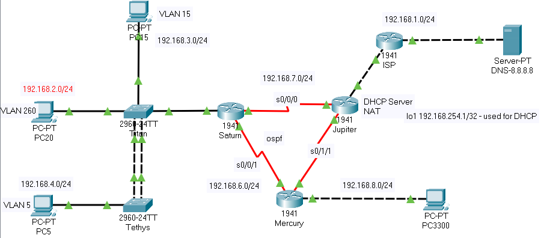

# project_x7_everything
***PACKET TRACER EXAM PREP***

---DIAGRAM ANALYSIS---

What technologies will we be working with today?
IP Addressing
Etherchannel
VLANs and subinterfaces
Routing (OSPF)
NAT
DHCP
RSTP

	! How many collision domains can we see currently in the diagram? 
	A: 9
	! How many broadcast domains are currently in the diagram? 
	A: 7

---SUBNETTING---

Netw 3300	192.168.1.0/24
VLAN 260	192.168.2.0/24
VLAN 15		192.168.3.0/24
VLAN 5		192.168.4.0/24
VLAN 1		192.168.5.0/24
SAT-MER		192.168.6.0/24
SAT-JUP		192.168.7.0/24
MER-JUP		192.168.8.0/24
JUP-DHCP	192.168.254.1/32

---TEMPLATE---

en
conf t
no ip domain-l
username chris secret cisco123
username student secret cisco123
enable secret cisco	
hostname MERCURY
line console 0	
logging sync	
exec-time 10 46
exit
ip domain-name chrisco.com
crypto key gen rsa genera mod 2048
line vty 0 4
login local
exec-time 8 15
transport input ssh
exit
service password-encryption

*TETHYS

---HOUSEKEEPING---

Switch>en
Switch#conf t
Switch(config)#no ip domain-l
Switch(config)#username chris secret cisco123
Switch(config)#username student secret cisco123
Switch(config)#enable secret cisco
Switch(config)#hostname TETHYS
TETHYS(config)#line console 0
TETHYS(config-line)#logging sync
TETHYS(config-line)#exec-time 10 46
TETHYS(config-line)#exit
TETHYS(config)#ip domain-name chrisco.com
TETHYS(config)#crypto key gen rsa genera mod 2048
TETHYS(config)#line vty 0 15
TETHYS(config-line)#login local
TETHYS(config-line)#exec-time 8 15
TETHYS(config-line)#transport input ssh
TETHYS(config-line)#exit
TETHYS(config)#service password-encryption

---VLAN CONFIGURATION---

TETHYS(config)#vlan 5
TETHYS(config-vlan)#name LUNA
TETHYS(config-vlan)#vlan 260
TETHYS(config-vlan)#name EARTH
TETHYS(config-vlan)#vlan 15
TETHYS(config-vlan)#name VENUS
TETHYS(config-vlan)#exit

	! What file stores the VLAN database on a switch? 
	A: vlan.dat
	! Where is that file? 
	A: Flash

---INTERFACE CONFIGURATION AND PORT SECURITY---

TETHYS(config-if)#switchport mode access
TETHYS(config-if)#switchport access vlan 5
TETHYS(config-if)#switchport port-security
TETHYS(config-if)#switchport port-security mac-address sticky
TETHYS(config-if)#switchport port-security maximum 3
TETHYS(config-if)#exit

	! What does maximum mean? 
	A: Maximum number of MAC addresses that will be learned.

TETHYS(config-if)#switchport port-security violation restrict

	! What are the other violation modes for switchport security? 
	A: Protect, Shutdown (default)

---ETHERCHANNEL---

	! Before we configure the trunk, if we took a look at the RSTP configuration, 
	what port states might we see on the output? 
	A: Discarding, Learning, Forwarding

	! Other than a visual inspection, let's see if we can figure out which switch 
	should be the root bridge.
	A: Default Priority: 32768
	TITAN MAC 0001.C716.EE50
	TETHYS MAC 0006.2A3E.BD93
	Why is port gi0/2 the blocked port?
	A: STP prefers lower numbers, so gi0/1 would be the root port.
	
TETHYS(config)#int range gi0/1 - 2
TETHYS(config-if-range)#channel-group 1 mode active
TETHYS(config-if-range)#exit
TETHYS(config)#int po1
TETHYS(config-if)#switchport mode trunk
TETHYS(config-if)#switchport trunk allowed vlan 1,5,15,260

	! We've created a trunk... what protocol was used to create the trunk? What's the other protocol that we could have used to create the trunk? 
	A: 802.1Q, ISL
	
---VLAN 1---

TETHYS(config)#int vlan 1
TETHYS(config-if)#ip add 192.168.5.3 255.255.255.0
TETHYS(config-if)#no shutdown
TETHYS(config-if)#exit
TETHYS(config)#ip default-gateway 192.168.5.1
TETHYS(config)#end
TETHYS#copy running-config startup-config

	! Where is the running-config file stored? 
	A: RAM
	! Where is the startup-config file stored? 
	A: NVRAM
	
*TITAN

---HOUSEKEEPING---

Switch>en
Switch#conf t
Switch(config)#no ip domain-l
Switch(config)#username chris secret cisco123
Switch(config)#username student secret cisco123
Switch(config)#enable secret cisco
Switch(config)#hostname TITAN
TITAN(config)#line console 0
TITAN(config-line)#logging sync
TITAN(config-line)#exec-time 10 46
TITAN(config-line)#exit
TITAN(config)#ip domain-name chrisco.com
TITAN(config)#crypto key gen rsa genera mod 2048
TITAN(config)#line vty 0 15
TITAN(config-line)#login local
TITAN(config-line)#exec-time 8 15
TITAN(config-line)#transport input ssh
TITAN(config-line)#exit
TITAN(config)#service password-encryption

---VLAN CONFIGURATION---

TITAN(config)#vlan 5
TITAN(config-vlan)#name LUNA
TITAN(config-vlan)#vlan 15
TITAN(config-vlan)#name EARTH
TITAN(config-vlan)#vlan 260
TITAN(config-vlan)#name VENUS
TITAN(config-vlan)#exit
TITAN(config)#spanning-tree mode rapid-pvst

---INTERFACE CONFIGURATION---

TITAN(config)#int fa0/20
TITAN(config-if)#switchport mode access
TITAN(config-if)#switchport access vlan 260
TITAN(config-if)#exit
TITAN(config)#int fa0/15
TITAN(config-if)#switchport mode access
TITAN(config-if)#switchport access vlan 15
TITAN(config-if)#exit
TITAN(config)#int range fa0/2-24
TITAN(config-if-range)#switchport mode access
TITAN(config-if-range)#switchport port-security
TITAN(config-if-range)#switchport port-security mac-address sticky
TITAN(config-if-range)#switchport port-security maximum 3
TITAN(config-if-range)#switchport port-security violation restrict
TITAN(config-if-range)#exit

---ETHERCHANNEL---

TITAN(config)#int range gi0/1 - 2
TITAN(config-if-range)#channel-group 3 mode passive
TITAN(config-if-range)#do show interface trunk
Port        Mode         Encapsulation  Status        Native vlan
Po3         auto         n-802.1q       trunking      1

TITAN(config-if-range)#exit
TITAN(config)#int po3
TITAN(config-if)#switchport trunk allowed vlan 1,5,15,260
TITAN(config-if)#exit
TITAN(config)#int fa0/1
TITAN(config-if)#switchport mode trunk
TITAN(config-if)#switchport trunk allowed vlan 1,5,15,260
TITAN(config-if)#exit

---VLAN 1---

TITAN(config)#int vlan 1
TITAN(config-if)#ip add 192.168.5.2 255.255.255.0
TITAN(config-if)#no shut
TITAN(config-if)#exit
TITAN(config)#ip default-gateway 192.168.5.1
TITAN(config)#end
TITAN#copy run start

---VERIFICATION---

TITAN#show int tr
Port        Mode         Encapsulation  Status        Native vlan
Po3         auto         n-802.1q       trunking      1

Port        Vlans allowed on trunk
Po3         1,5,15,260

TITAN#show vlan brief

VLAN Name                             Status    Ports
---- -------------------------------- --------- ----------------------
1    default                          active    Fa0/1, Fa0/2, Fa0/3, Fa0/4
                                                Fa0/5, Fa0/6, Fa0/7, Fa0/8
                                                Fa0/9, Fa0/10, Fa0/11, Fa0/12
                                                Fa0/13, Fa0/14, Fa0/16, Fa0/17
                                                Fa0/18, Fa0/19, Fa0/21, Fa0/22
                                                Fa0/23, Fa0/24
5    LUNA                             active    
15   EARTH                            active    Fa0/15
20   VLAN0020                         active    
260  VENUS                            active    Fa0/20

*SATURN

---HOUSEKEEPING---

Router>en
Router#conf t
Router(config)#no ip domain-lookup 
Router(config)#username chris secret cisco123
Router(config)#username student secret cisco123
Router(config)#enable secret cisco
Router(config)#hostname SATURN
SATURN(config)#line console 0
SATURN(config-line)#logging synchronous 
SATURN(config-line)#exec-time 10 46
SATURN(config-line)#exit
SATURN(config)#ip domain-name chrisco.com
SATURN(config)#crypto key gen rsa genera mod 2048
SATURN(config)#line vty 0 4
SATURN(config-line)#login local
SATURN(config-line)#exec-time 8 15
SATURN(config-line)#transport input ssh
SATURN(config-line)#exit
SATURN(config)#service password-encryption

---INTERFACE CONFIGURATION---

SATURN(config)#int gi0/0.1
SATURN(config-subif)#encapsulation dot1q 1
SATURN(config-subif)#ip address 192.168.5.1 255.255.255.0
SATURN(config-subif)#exit
SATURN(config)#int gi0/0.5
SATURN(config-subif)#encapsulation dot1q 5
SATURN(config-subif)#ip address 192.168.4.1 255.255.255.0
SATURN(config-subif)#exit
SATURN(config)#int gi0/0.15
SATURN(config-subif)#encap dot1q 15
SATURN(config-subif)#ip add 192.168.3.1 255.255.255.0
SATURN(config-subif)#exit
SATURN(config)#int gi0/0.260
SATURN(config-subif)#encap dot1q 260
SATURN(config-subif)#ip add 192.168.2.1 255.255.255.0
SATURN(config-subif)#exit
SATURN(config)#int gi0/0
SATURN(config-if)#no shutdown
SATURN(config-if)#exit
SATURN(config)#int s0/0/0
SATURN(config-if)#description SAT-JUP
SATURN(config-if)#ip add 192.168.7.1 255.255.255.0
SATURN(config-if)#no shut
SATURN(config-if)#exit
SATURN(config)#int s0/0/1
SATURN(config-if)#desc SAT-MER
SATURN(config-if)#ip add 192.168.6.1 255.255.255.0
SATURN(config-if)#no sh
SATURN(config-if)#exit

---OSPF---

SATURN(config)#router ospf 6
SATURN(config-router)#router-id 6.6.6.6
SATURN(config-router)#network 192.168.5.0 0.0.0.255 area 0
SATURN(config-router)#network 192.168.4.0 0.0.0.255 area 0
SATURN(config-router)#network 192.168.3.0 0.0.0.255 area 0
SATURN(config-router)#network 192.168.2.0 0.0.0.255 area 0
SATURN(config-router)#network 192.168.7.0 0.0.0.255 area 0
SATURN(config-router)#network 192.168.6.0 0.0.0.255 area 0
SATURN(config-router)#passive-interface gi0/0.1
SATURN(config-router)#passive-interface gi0/0.5
SATURN(config-router)#passive-interface gi0/0.15
SATURN(config-router)#passive-interface gi0/0.260
SATURN(config-router)#end
SATURN#copy run start

*MERCURY

---HOUSEKEEPING---

Router>en
Router#conf terminal 
Router(config)#no ip domain-lookup 
Router(config)#username chris secret cisco123
Router(config)#username student secret cisco123
Router(config)#enable secret cisco
Router(config)#hostname MERCURY
MERCURY(config)#line console 0
MERCURY(config-line)#logging synchronous 
MERCURY(config-line)#exec-time 10 46
MERCURY(config-line)#exit
MERCURY(config)#ip domain-name chrisco.com
MERCURY(config)#crypto key gen rsa genera mod 2048
MERCURY(config)#line vty 0 4
MERCURY(config-line)#login local
MERCURY(config-line)#exec-time 8 15
MERCURY(config-line)#transport input ssh
MERCURY(config-line)#exit
MERCURY(config)#service password-encryption

---INTERFACE CONFIGURATION---

MERCURY(config)#int s0/0/1
MERCURY(config-if)#ip add 192.168.6.2 255.255.255.0
MERCURY(config-if)#no sh
MERCURY(config-if)#exit
MERCURY(config)#int s0/1/1
MERCURY(config-if)#ip add 192.168.8.2 255.255.255.0
MERCURY(config-if)#no sh
MERCURY(config-if)#exit
MERCURY(config)#int gi0/0
MERCURY(config-if)#ip add 192.168.1.1 255.255.255.0
MERCURY(config-if)#no shut
MERCURY(config-if)#ip helper-address 192.168.254.1
MERCURY(config-if)#exit

	! Let's say we were configuring an IPv6 address here. 
	If I wanted to enable IPv6 routing, what command would I use?
	A: # ipv6 unicast-routing
	! Let's also say that I had an IPv6 address on the interface. What procedure would our 	
	PC-3300 use to calculate it's own IPv6 address?
	A: EUI-64
	! What method would the host use to learn the IPv6 prefix from the router?
	A: A multicasted neighbor discovery message (replacement for ARP)
	! Let's calculate that address. Assume A111:025D::/64 as the prefix
	A: MAC address: 0050.0F4D.775A
	Convert and add FFFE: 250:FFF:FE4D:775A
	Combine with prefix and reduce: A111:25D::250:FFF:FE4D:775A/64

---OSPF---

MERCURY(config)#router ospf 1
MERCURY(config-router)#router-id 1.1.1.1
MERCURY(config-router)#net 192.168.1.0 0.0.0.255 area 0
MERCURY(config-router)#net 192.168.6.0 0.0.0.255 area 0
MERCURY(config-router)#net 192.168.8.0 0.0.0.255 area 0
MERCURY(config-router)#passive-interface gi0/0
MERCURY(config-router)#end
MERCURY#copy run start

*JUPITER

---HOUSEKEEPING---

Router>en
Router#conf t
Enter configuration commands, one per line.  End with CNTL/Z.
Router(config)#no ip domain-l
Router(config)#username chris secret cisco123
Router(config)#username student secret cisco123
Router(config)#enable secret cisco
Router(config)#hostname JUPITER
JUPITER(config)#line console 0
JUPITER(config-line)#logging synchronous 
JUPITER(config-line)#exec-time 10 46
JUPITER(config-line)#exit
JUPITER(config)#ip domain-name chrisco.com
JUPITER(config)#crypto key gen rsa genera mod 2048
JUPITER(config)#line vty 0 4
JUPITER(config-line)#login local
JUPITER(config-line)#exec-time 8 15
JUPITER(config-line)#transport input ssh
JUPITER(config-line)#exit
JUPITER(config)#service password-encryption

---INTERFACE CONFIGURATION---

JUPITER(config)#int s0/0/0
JUPITER(config-if)#ip add 192.168.7.2 255.255.255.0
JUPITER(config-if)#no sh
JUPITER(config-if)#exit
JUPITER(config)#int s0/1/1
JUPITER(config-if)#ip add 192.168.8.1 255.255.255.0
JUPITER(config-if)#no sh
JUPITER(config-if)#exit
JUPITER(config)#int gi0/0
JUPITER(config-if)#ip add 50.50.50.1 255.255.255.252
JUPITER(config-if)#no sh
JUPITER(config-if)#exit
JUPITER(config)#int lo1
JUPITER(config-if)#ip add 192.168.254.1 255.255.255.255
JUPITER(config-if)#exit

---DHCP CONFIGURATION---

JUPITER(config)#ip dhcp excluded-address 192.168.1.1 192.168.1.5
JUPITER(config)#ip dhcp excluded-address 192.168.2.1 192.168.2.5
JUPITER(config)#ip dhcp excluded-address 192.168.3.1 192.168.3.5
JUPITER(config)#ip dhcp excluded-address 192.168.4.1 192.168.4.5
JUPITER(config)#ip dhcp pool VLAN5
JUPITER(dhcp-config)#net 192.168.4.0 255.255.255.0
JUPITER(dhcp-config)#default-router 192.168.4.1
JUPITER(dhcp-config)#dns-server 8.8.8.8
JUPITER(dhcp-config)#exit
JUPITER(config)#ip dhcp pool VLAN15
JUPITER(dhcp-config)#net 192.168.3.0 255.255.255.0
JUPITER(dhcp-config)#def 192.168.3.1
JUPITER(dhcp-config)#dns 8.8.8.8
JUPITER(dhcp-config)#exit
JUPITER(config)#ip dhcp pool VLAN260
JUPITER(dhcp-config)#net 192.168.2.0 255.255.255.0
JUPITER(dhcp-config)#def 192.168.2.1 
JUPITER(dhcp-config)#dns 8.8.8.8
JUPITER(dhcp-config)#exit
JUPITER(config)#ip dhcp pool Netw3300
JUPITER(dhcp-config)#net 192.168.1.0 255.255.255.0
JUPITER(dhcp-config)#def 192.168.1.1
JUPITER(dhcp-config)#dns 8.8.8.8
JUPITER(dhcp-config)#exit

---ROUTING---

JUPITER(config)#ip route 0.0.0.0 0.0.0.0 50.50.50.2
JUPITER(config)#router ospf 5
JUPITER(config-router)#router-id 5.5.5.5
JUPITER(config-router)#network 192.168.7.0 0.0.0.255 area 0
JUPITER(config-router)#network 192.168.8.0 0.0.0.255 area 0
JUPITER(config-router)#network 192.168.254.1 0.0.0.0 area 0
JUPITER(config-router)#default-information originate

---NAT AND ACLS---

JUPITER(config)#ip access-list standard NAMED
JUPITER(config-std-nacl)#permit 192.168.0.0 0.0.3.255
JUPITER(config-std-nacl)#permit 192.168.4.0 0.0.0.255
JUPITER(config-std-nacl)#exit
JUPITER(config)#ip nat inside source list NAMED interface gi0/0 overload
JUPITER(config)#int gi0/0
JUPITER(config-if)#ip nat outside
JUPITER(config-if)#int s0/0/0
JUPITER(config-if)#ip nat inside
JUPITER(config-if)#int s0/1/1
JUPITER(config-if)#ip nat inside
JUPITER(config-if)#exit

*SATURN

SATURN(config)#int gi0/0.5
SATURN(config-subif)#ip helper-address 192.168.254.1
SATURN(config-subif)#int gi0/0.15
SATURN(config-subif)#ip helper-address 192.168.254.1
SATURN(config-subif)#int gi0/0.260
SATURN(config-subif)#ip helper-address 192.168.254.1

