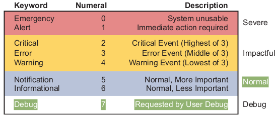

# syslog_ntp

Debug command and generate log messages about any related events.

`logging console 7 ` command tells us that the console user will receive severity levels 0–7


Finally, the last level in the figure is used for messages requested by the `debug` command

Console logging console 
Monitor logging monitor 
Buffered logging buffered 
Syslog logging host address | hostname 
```
logging console 7
logging monitor debug
logging buffered 4
logging host 172.16.3.9
logging trap warning
```
to check result do `show logging`

command to see those debug messages on remote connections
```
logging monitor (sends logs to the vty connection)
terminal monitor
```

Layer 2 discovery protocols (CDP, LLDP)

UDP port 123 Network time protocol

Set a router clock manually with the command
```
clock set <24-hr time> <day> <month> <year>
show clock
```

NTP configuration
`ntp master <stratum level>`
`show ntp status`
`show ntp associations`

LLDP link layer discovery protocol

Types of NAT • Static NAT • Dynamic NAT (where the fun starts) • Overloading (lots of internal addresses to a single outside address)


