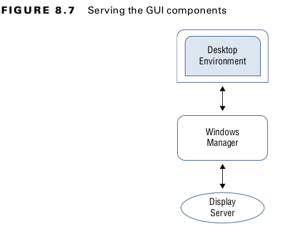

# GUI

GNOME
++++++
display manager - GDM
File manager - Naitilus
Window manager - Mutter

KDE
++++++
display manager - SDOM
File manager - Dolphin
Window manager - KWIN

CINNAMON
++++++
display manager - LightDM
File manager - Nemo
Window manager - Muffin

MATE
++++++
display manager - LightDM
File manager - Caja
Window manager - Marco

UNITY
++++++
display manager - LightDM
File manager - Nautilus
Window manager - Metacity

brltty and ORCA for blind

++++++++++++++
DETECT DESKTOP MANAGER
++++++++++++++

1) loginctl   # to detect session id
2) loginctl show-session c2 <session-id> -p Type

--------------------------

env | grep -i desktop

--------------------------

The Wayland compositor is Weston.
Several compositors are available for use with Wayland, including Arcan, Sway, Lipstick, and Clayland

Display Manager Control Protocol (XDMCP). The main configuration file is /etc/X11/xdm/xdm-config

If you need to troubleshoot X problems, two utilities can help. They are `xdpyinfo` and `xwininfo`.

Desktop implementations for Linux. They include VNC, Xrdp, NX, and SPICE
VNC, by default, does not provide traffic encryption, so you must employ another means of protection, such as tunneling through OpenSSH.
One can fix it by implementing local port forwarding:
Step1) ssh -L 5901:localhost:5901 REMOTE_IP
Step2 ) using vncview connect to local machine on port 5901. The stream will be forwarded throught ssh to server (encrypted).

Xrdp is an alternative to VNC ® . It supports the Remote Desktop Protocol (RDP) port - 3389. 

******************************************************************************************************
LOCALIZATION
******************************************************************************************************

`locale` command

`locale -ck LC_MONETARY`  # detailed

To change : manually set the LC_ environment variables, or you can use the localectl command.

manual : `export LC_MONETARY=en_GB.UTF-8`  # to change individual 
manual: `export LC_MONETARY=en_GB.UTF-8`  # to change ALL
To make it permanent, put it in .bashrc . 

`localectl` # to check/list
`localectl set-locale LANG=en_GB.utf8`  # to change 

Each country selects one or more time zones, or offsets from the standard Coordinated Universal Time (UTC) time.

Timezone on ubuntu : /etc/timezone
Timezone on red hat: /etc/localtime

time zone templates are located in `/usr/share/zoneinfo`

TO CHANGE TIMEZONE, SIMPLY COPY CORRESPONDING TEMPLATE TO /etc/timezone OR /etc/localtime(RED HAT)

TIME:
■  hwclock displays or sets the time as kept on the internal BIOS or UEFI clock on theworkstation or server.
■  date displays or sets the date as kept by the Linux system.

Ta b l e 9 .1
The date format command sequences
Sequence Description
%a Abbreviated weekday name
%A Full weekday name
%b Abbreviated month name
%B Full month name
%c Date and time
%C Century (e.g., 20)
%d Numeric day of month
%D Full numeric date
%e Day of month, space padded
%F Full date in SQL format (YYYY-MM-dd)
%g Last two digits of year of ISO week number
%G Year of the ISO week number
%h Alias for %b
%H Hour in 24-hour format
%I Hour in 12-hour format
%j Numeric day of year
%k Hour in 24-hour format, space padded
%l Hour in 12-hour format, space padded
%m Numeric month
%M Minute
%n A newline character
%N Nanoseconds
%p AM or PM
%P Lowercase am or pm
%r Full 12-hour clock time
%R Full 24-hour hour and minute
%s Seconds since 1970-01-01 00:00:00 UTC
%S Second
%t A tab character
%T Full time in hour:minute:second format
%u Numeric day of week, 1 is Monday
%U Numeric week number of year, starting on Sunday
%V ISO week number
%w Numeric day of week, 0 is Sunday
%W Week number of year, starting on Monday
%x Locale's date representation as month/day/year or day/month/year
%X Locale’s full time representation
%y Last two digits of the year
%Y Full year
%z Time zone in +hhmm format
%:z Time zone in +hh:mm format
%::z Time zone in +hh:mm:ss format
%:::z Numeric time zone with : to necessary precision
%Z Alphabetic time zone abbreviation

TO SET THE TIME, USE COMMAND `Ta b l e 9 .1
The date format command sequences
Sequence Description
%a Abbreviated weekday name
%A Full weekday name
%b Abbreviated month name
%B Full month name
%c Date and time
%C Century (e.g., 20)
%d Numeric day of month
%D Full numeric date
%e Day of month, space padded
%F Full date in SQL format (YYYY-MM-dd)
%g Last two digits of year of ISO week number
%G Year of the ISO week number
%h Alias for %b
%H Hour in 24-hour format
%I Hour in 12-hour format
%j Numeric day of year
%k Hour in 24-hour format, space padded
%l Hour in 12-hour format, space padded
%m Numeric month
%M Minute
%n A newline character
%N Nanoseconds
%p AM or PM
%P Lowercase am or pm
%r Full 12-hour clock time
%R Full 24-hour hour and minute
%s Seconds since 1970-01-01 00:00:00 UTC
%S Second
%t A tab character
%T Full time in hour:minute:second format
%u Numeric day of week, 1 is Monday
%U Numeric week number of year, starting on Sunday
%V ISO week number
%w Numeric day of week, 0 is Sunday
%W Week number of year, starting on Monday
%x Locale's date representation as month/day/year or day/month/year
%X Locale’s full time representation
%y Last two digits of the year
%Y Full year
%z Time zone in +hhmm format
%:z Time zone in +hh:mm format
%::z Time zone in +hh:mm:ss format
%:::z Numeric time zone with : to necessary precision
%Z Alphabetic time zone abbreviation`

TO SET THE DATE AND TIME, USE `date MMDDhhmm[[CC]YY][.ss]`

------------------OR USING SYSTEMD------------------------------------------
`timedatectl`   #to check
`timedatectl set-time "2018-10-06 10:35:00"`   #to  set it up

