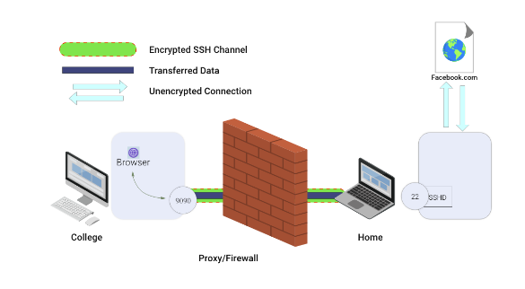

# SSH

Generation of sectet key (symetric ) key that is used to encrypt connection (Diffie-Hellman algorithm):
https://www.digitalocean.com/community/tutorials/understanding-the-ssh-encryption-and-connection-process

Linux has standard folders/files for SSH:

    The SSH files are stored in "~/.ssh"
    The tilde ~ is an alias for the user home folder, e.g., /home/<your username>

    The public key filename is the private key filename with .pub as the extension.

    Stored (known) server fingerprints are written to known_hosts
    This is used to detect "man in the middle" attacks. If the host fingerprint changes, SSH will report an error.

    The file authorized_keys is used to store public keys
    This is used to allow the user to maintain a collection of identity keys in one place (easier to backup and restore). The authorized_keys file is a collection of public keys, created by simply echoing out (cat) the contents of a public key, appending it to the bottom of the existing authorized_keys file.

    SSH keys must have 600 or more restrictive permissions in place
    If permissions are too open, SSH will report an error and refuse to run until you correct the security problem.

-------------------------------------------------------------------------------------------------------------------
**what-is-the-difference-between-authorized-keys-and-known-hosts-file-for-ssh**
__________________________________________________________________________________________

**Server authentication**

One of the first things that happens when the SSH connection is being established is that the server sends its public key to the client, 
and proves (thanks to public-key cryptography) to the client that it knows the associated private key. This authenticates the server: 
if this part of the protocol is successful, the client knows that the server is who it claims it is.

The client may check that the server is a known one, and not some rogue server trying to pass off as the right one. 
SSH provides only a simple mechanism to verify the server's legitimacy: it remembers servers you've already connected to, 
in the ~/.ssh/known_hosts file on the client machine (there's also a system-wide file /etc/ssh/known_hosts). 
The first time you connect to a server, you need to check by some other means that the public key presented by the server is really the public key of the server you wanted to connect to. 
If you have the public key of the server you're about to connect to, you can add it to ~/.ssh/known_hosts on the client manually.

By the way, known_hosts can contain any type of public key supported by the SSH implementation, not just DSA (also RSA and ECDSA).

Authenticating the server has to be done before you send any confidential data to it. In particular, if the user authentication involves a password, the password must not be sent to an unauthenticated server.

**User authentication**

The server only lets a remote user log in if that user can prove that they have the right to access that account.
 Depending on the server's configuration and the user's choice, the user may present one of several forms of credentials (the list below is not exhaustive).

-------------------------------------------------------------------------------------------------------------------
**what-is-the-difference-between-authorized-keys-and-known-hosts-file-for-ssh**
__________________________________________________________________________________________

**Authorized Keys**

By default SSH uses user accounts and passwords that are managed by the host OS. (Well, actually managed by PAM but that distinction probably isn't too useful here.) 
What this means is that when you attempt to connect to SSH with the username 'bob' and some password the SSH server program will ask the 
OS "I got this guy named 'bob' who's telling me his password is 'wonka'. Can I let him in?" If the answer is yes, then SSH allows you to authenticate and you go on your merry way.

In addition to passwords SSH will also let you use what's called public-key cryptography to identify you. The specific encryption algorithm can vary, but is usually RSA or DSA, 
or more recently ECDSA. In any case when you set up your keys, using the ssh-keygen program, you create two files. One that is your private key and one that is your public key.
 The names are fairly self-explanatory. By design the public key can be strewn about like dandelion seeds in the wind without compromising you. 
 The private key should always be kept in the strictest of confidence.

So what you do is place your public key in the authorized_keys file. Then when you attempt to connect to SSH with username 'bob' and your private key it will ask the 
OS "I got this guy name 'bob', can be be here?" If the answer is yes then SSH will inspect your private key and verify if the public key in the authorized_keys file is its pair. 
If both answers are yes, then you are allowed in.

**Known Hosts**

Much like how the authorized_keys file is used to authenticate users the known_hosts file is used to authenticate servers. Whenever SSH is configured on a new server it always 
generates a public and private key for the server, just like you did for your user. Every time you connect to an SSH server, it shows you its public key, together with a proof that it 
possesses the corresponding private key. If you do not have its public key, then your computer will ask for it and add it into the known_hosts file. If you have the key, and it matches, 
then you connect straight away. If the keys do not match, then you get a big nasty warning. This is where things get interesting. The 3 situations that a key mismatch typically happens are:

+++++++++++++++++++++++++++++++++++++++++++++++++++++++++++++++++++++++++++++++++++++++++++++++++++++++
**PORT_FORWARDING_PORT_FORWARDING_PORT_FORWARDING_PORT_FORWARDING_PORT_FORWARDING_PORT_FORWARDING**
+++++++++++++++++++++++++++++++++++++++++++++++++++++++++++++++++++++++++++++++++++++++++++++++++++++++

What is SSH tunneling and reverse port forwarding?

Introduction

SSH tunnel consists of an encrypted tunnel which is created through a SSH protocol. This tunnel can be used to transfer unencrypted traffic through an encrypted channel over the network. For example we can use a SSH tunnel to securely transfer files.

SSH tunnels are also used for bypassing firewalls that deny certain internet services.
Port Forwarding

SSH tunnels can be created in various ways depending on which type of port forwarding is used:
There are three types of port forwarding:

    Local port forwarding
    Remote port forwarding
    Dynamic port forwarding

Tunnelling with Local port forwarding

Lets say, yahoo.com is being blocked using a proxy filter at your college. An SSH tunnel can be used to bypass this restriction. Let’s give name to my machine at college as “college-pc” and my home machine as “home-pc” (SSH server should be running on “home-pc”)
To create the SSH tunnel that is executed from “college-pc” use the below command:
`ssh -L 9090:facebook.com:80 <user>@home-pc`
-L indicates that this is local port forwarding
Now SSH client at college-pc is connected to SSH server running at “home-pc”.
 This is also binding port 9090 of college-pc to listen to all local requests thus creating an SSH tunnel between “college-pc” and “home-pc”.
 
At the home-pc side, It will create a connection to yahoo.com at port 80. home-pc will think of how to connect to yahoo rather than college-pc.

Now we can browse yahoo.com at work using localhost:9090
The home-pc will act as a gateway.
Reverse Tunnelling with remote port forwarding

Let’s say you want to connect to an internal university website from the home-pc system.

The university firewall will block its incoming traffic. We have to use SSH reverse tunnelling here.
`ssh -R 9090:intra-site.com:80 <user>@home-pc (Executed from college-pc)`
We will use the option -R for reverse tunneling.
Once done, The SSH client at college-pc will connect to the SSH server running at home-pc. Then the server will bind port 9090 on home-pc to listen to all incoming requests.
By visiting localhost:9090 at home-pc, the college-pc will create a connection to the internal site and give back the response to home-pc via the created SSH channel.

+++++++++++++++++++++++++++++++++++++++++++++++++++++++++++
DYNAMIC PORT FORWARDING
+++++++++++++++++++++++++++++++++++++++++++++++++++++++++++

Dynamic port forwarding turns your SSH client into a SOCKS proxy server. 
SOCKS is a little-known but widely-implemented protocol for programs to request any Internet connection through a proxy server. 
Each program that uses the proxy server needs to be configured specifically, and reconfigured when you stop using the proxy server.

For example, say you wanted Firefox to connect to every web page through your SSH server. First you would use dynamic port forwarding with the default SOCKS port:

ssh -C -D 1080 192.168.100.133

The -D option specifies dynamic port forwarding. 1080 is the standard SOCKS port. Although you can use any port number, some programs will only work if you use 1080. 
-C enables compression, which speeds the tunnel up when proxying mainly text-based information (like web browsing), 
but can slow it down when proxying binary information (like downloading files).

Next you would tell Firefox to use your proxy:

    go to Edit -> Preferences -> Advanced -> Network -> Connection -> Settings...
    check "Manual proxy configuration"
    make sure "Use this proxy server for all protocols" is cleared
    clear "HTTP Proxy", "SSL Proxy", "FTP Proxy", and "Gopher Proxy" fields
    enter "127.0.0.1" for "SOCKS Host"
    enter "1080" (or whatever port you chose) for Port. 

You can also set Firefox to use the DNS through that proxy, so even your DNS lookups are secure:

    Type in about:config in the Firefox address bar
    Find the key called "network.proxy.socks_remote_dns" and set it to true 

The SOCKS proxy will stop working when you close your SSH session. You will need to change these settings back to normal in order for Firefox to work again.

To make other programs use your SSH proxy server, you will need to configure each program in a similar way.

TO TEST IT , USE ITERNAL IP TO ACCESS INTERNAL WEB-SERVER FROM THE BROWSER:

10.0.0.10:80
10.0.0.11:80