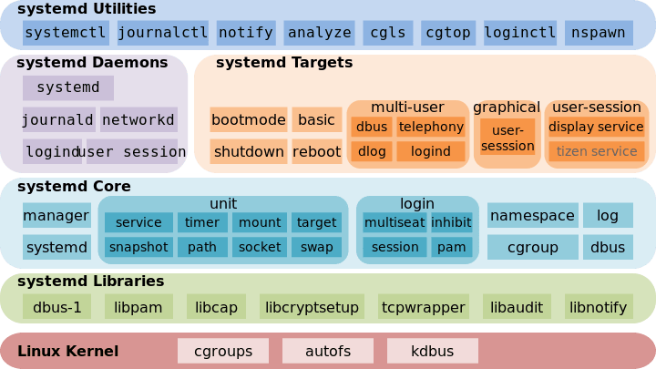

# SYSTEMD

The system’s copy of unit files are generally kept in the ~~**/lib/systemd/system**x~~ directory.
 You should not edit files in this directory. Instead you should override the file, if necessary, using another unit file location which will supersede the file in this location.
 
If you wish to modify the way that a unit functions, the best location to do so is within the /etc/systemd/system directory. 
Unit files found in this directory location take precedence over any of the other locations on the filesystem.

Once service enabled is enabled, symbolic link is created in:
    - /etc/systemd/system
    - /etc/systemd/system/multy.user.target

Disabling the service deletes the link from /etc... folder and just keeps one copy in /lib/systemd/system

Once masked symbolic link is created in:
    - /etc/systemd/system 
and it points to /dev/null which supercedes existins link in lets say /etc/systemd/system/multy-user.target