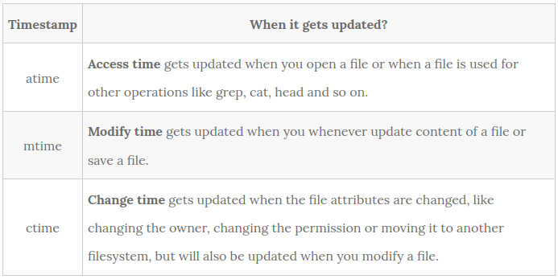

# file_filesystem

`stat myfile` # gives stats on the file

   Update  inode  access times relative to modify or change time.   Access time is only updated if the previous access time was earlier than the current modify or change time. 
   (Similar to noatime, but doesn't break mutt or other applications that need to know if a file has been read since the last time it was modified.)
   