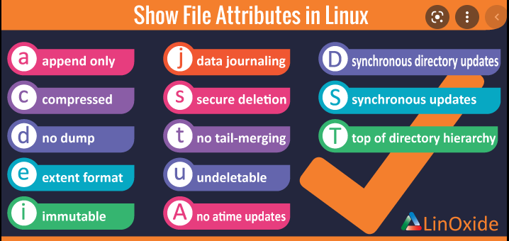
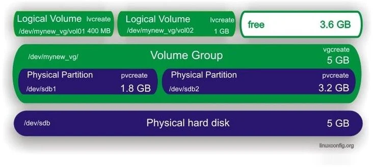

# storage

udev program runs in background at all times and automatically detects new hardware connected to the running Linux system.

dev/disk folder to create links to the /dev storage device files based on unique attributes of the drive.
by-ad, by-label, by-path, by-uuid

Common fdisk commands:
a Toggle a bootable flag.
b Edit bsd disk label.
c Toggle the DOS compatibility flag.
d Delete a partition.
g Create a new empty GPT partition table.
G Create an IRIX (SGI) partition table.
l List known partition types.
m Print this menu.
n Add a new partition.
o Create a new empty DOS partition table.
p Print the partition table.
q Quit without saving changes.
s Create a new empty Sun disklabel.
t Change a partition’s system ID.
u Change display/entry units.
v Verify the partition table.
w Write table to disk and exit.
x Extra functionality (experts only).

If you’re working with drives that use the GPT indexing method, you’ll need to use the gdisk program:
■ btrfs: A newer, high-performance filesystem
eCryptfs: The Enterprise Cryptographic File System (eCryptf
ext3: added journaling
ext4: files up to 16TiB, with a total filesystem size of 1EiB
swap: The swap filesystem allows you to create virtual memory
XFS: The X File System (XFS) advanced high-­performance features that makes it still popular in Linux.
ZFS - high-performance filesystem, it has features similar to the btrfs Linux filesystem.

To create file system on linux, use mkfs
sudo mkfs -t ext4 /dev/sdb1

mount -t fstype device mountpoint

For permanent storage devices, Linux maintains the /etc/fstab file to indicate which drive devices should be mounted to the virtual directory at boot time.

df displays disk usage by partition.
du displays disk usage by directory, good for finding users or applications that are taking up the most disk space.
■ iostat displays a real-time chart of disk statistics by partition.
■ lsblk displays current partition sizes and mount points.
■ blkid - 

File's attributes:


lsattr <filename>

chattr # change attribute of file. Example `chattr +i myfile.txt`  added immutable flag

■ blkid displays information about block devices, such as storage drives.
■ chattr changes file attributes on the filesystem.
■
debugfs manually views and modifies the filesystem structure, such as undeleting a file
or extracting a corrupt file.
■ dumpe2fs displays block and superblock group information.
■ e2label changes the label on the filesystem.
■ resize2fs expands or shrinks a filesystem.
■ tune2fs modifies filesystem parameters.

The DM-multipath feature uses the dynamic /dev/mapper device fi le folder in Linux.


■ ■ pvcreate creates a physical volume.
■ ■ vgcreate groups physical volumes into a volume group.
■ ■ lvcreate creates a logical volume from partitions in each physical volume.

1) sudo apt install lvm2
$ sudo dnf install lvm2
$ sudo pacman -S lvm2

2) `fdisk /dev/sdb` # for MBR `gdisk /dev/sdb` # for GPT
< n # to create
< +25000M # size
< t #type
< 8e Linux LVM type chosen

3) `pvcreate /dev/sdb1 /dev/sdc1 /dev/sdd1 /dev/sde1`

4) in in need to revert `pvremove /dev/sdb1 /dev/sdc1 /dev/sdd1 /dev/sde1`

`pvdisplay`

5) `vgcreate fileserver_group /dev/sdb1 /dev/sdc1 /dev/sdd1 /dev/sde1`
`vgdisplay`
`vgscan`

6) `vgextend fileserver_group /dev/sdb2` # to add extra phisical partition

7) `lvcreate -L 400 -n vol01 fileserver_group` #  logical volume named vol01 with a size of 400MB
`lvcreate -l 100%FREE -n lvdisk newvol` # create volume using persentage

8 ) `mkfs.ext4 -m 0 /dev/fileserver_group/vol01`

9) `vim /etc/fstab`
add
/dev/fileserver_group/vol01        /mount_point_folder    ext4    defaults    0    2

10 ) `lvextend -L +800 /dev/fileserver_group/vol01`
and also run
`resize2fs /dev/fileeserver_group/vol01`

On some systems, especially older ones, you may be required to unmount the volume and run e2fck before being able to extend it.
```
umount /foobar
e2fck -f /dev/mynew_vg/vol01
resize2fs /dev/mynew_vg/vol01
```


+++++++++++++++++++++++++++++++++++++++++++++++++++
++++++++++++++++++++RAID+++++++++++++++++++++++++++
+++++++++++++++++++++++++++++++++++++++++++++++++++

RAID technology allows you to improve data access performance and reliability as well as implement data redundancy for fault tolerance by
combining multiple drives into one virtual drive. There are several versions of RAID commonly used:

 RAID-0: Disk striping, spreads data across multiple disks for faster access.
 RAID-1: Disk mirroring duplicates data across two drives.
RAID-10: Disk mirroring and striping provides striping for performance and mirroring for fault tolerance
RAID-4: Disk striping with parity adds a parity bit stored on a separate disk so that data on a failed data disk can be recovered.
RAID-5: Disk striping with distributed parity adds a parity bit to the data stripe so that it appears on all of the disks so that any failed disk can be recovered.
RAID-6: Disk striping with double parity stripes both the data and the parity bit so two failed drives can be recovered.

